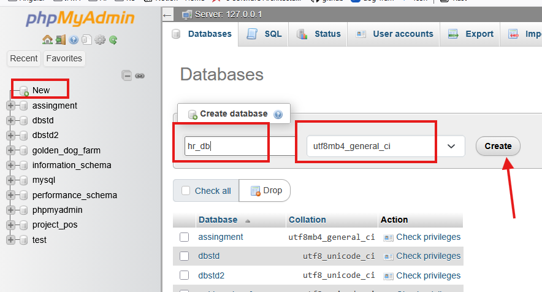

# Lab 01: Import Database 

## รายวิชา

On-Premise and Off-Premise Relational Database Management


---

## ขั้นตอนที่ 1: ติดตั้งและเริ่มต้น XAMPP

1. ดาวน์โหลด XAMPP จาก [https://www.apachefriends.org](https://www.apachefriends.org)
2. ติดตั้งโปรแกรมให้เรียบร้อย
3. เปิด **XAMPP Control Panel**
4. Start Service

   * Apache
   * MySQL

   
5. เปิด Browser เข้า `http://localhost/phpmyadmin`

---

## ขั้นตอนที่ 2: สร้างฐานข้อมูล (Database)

1. ไปที่ phpMyAdmin
2. คลิกเมนู **Databases**
3. สร้างฐานข้อมูลชื่อ

   ```text
   hr_db
   ```
4. เลือก Collation เป็น `utf8mb4_general_ci`

---

## ขั้นตอนที่ 3: SQL Script สำหรับ MariaDB

> หมายเหตุ: Script นี้ถูกแปลงจาก Oracle SQL ให้ใช้งานกับ **MariaDB (XAMPP)** แล้ว

```sql
SET FOREIGN_KEY_CHECKS = 0;

DROP TABLE IF EXISTS JOB_HISTORY;
DROP TABLE IF EXISTS EMPLOYEES;
DROP TABLE IF EXISTS DEPARTMENTS;
DROP TABLE IF EXISTS LOCATIONS;
DROP TABLE IF EXISTS COUNTRIES;
DROP TABLE IF EXISTS REGIONS;
DROP TABLE IF EXISTS JOB_GRADES;
DROP TABLE IF EXISTS JOBS;

SET FOREIGN_KEY_CHECKS = 1;

CREATE TABLE JOBS (
  JOB_ID VARCHAR(10) PRIMARY KEY,
  JOB_TITLE VARCHAR(35) NOT NULL,
  MIN_SALARY FLOAT,
  MAX_SALARY FLOAT
);

CREATE TABLE JOB_GRADES (
  GRADE_LEVEL VARCHAR(3),
  LOWEST_SAL INT,
  HIGHEST_SAL INT
);

CREATE TABLE REGIONS (
  REGION_ID INT PRIMARY KEY,
  REGION_NAME VARCHAR(25)
);

CREATE TABLE COUNTRIES (
  COUNTRY_ID CHAR(2) PRIMARY KEY,
  COUNTRY_NAME VARCHAR(40),
  REGION_ID INT,
  FOREIGN KEY (REGION_ID) REFERENCES REGIONS(REGION_ID)
);

CREATE TABLE LOCATIONS (
  LOCATION_ID INT PRIMARY KEY,
  STREET_ADDRESS VARCHAR(40),
  POSTAL_CODE VARCHAR(12),
  CITY VARCHAR(30) NOT NULL,
  STATE_PROVINCE VARCHAR(25),
  COUNTRY_ID CHAR(2),
  FOREIGN KEY (COUNTRY_ID) REFERENCES COUNTRIES(COUNTRY_ID)
);

CREATE TABLE DEPARTMENTS (
  DEPARTMENT_ID INT PRIMARY KEY,
  DEPARTMENT_NAME VARCHAR(30) NOT NULL,
  MANAGER_ID INT,
  LOCATION_ID INT,
  FOREIGN KEY (LOCATION_ID) REFERENCES LOCATIONS(LOCATION_ID)
);

CREATE TABLE EMPLOYEES (
  EMPLOYEE_ID INT PRIMARY KEY,
  FIRST_NAME VARCHAR(20),
  LAST_NAME VARCHAR(25) NOT NULL,
  EMAIL VARCHAR(25) UNIQUE NOT NULL,
  PHONE_NUMBER VARCHAR(20),
  HIRE_DATE DATE NOT NULL,
  JOB_ID VARCHAR(10) NOT NULL,
  SALARY FLOAT CHECK (SALARY > 0),
  COMMISSION_PCT FLOAT,
  MANAGER_ID INT,
  DEPARTMENT_ID INT,
  FOREIGN KEY (DEPARTMENT_ID) REFERENCES DEPARTMENTS(DEPARTMENT_ID),
  FOREIGN KEY (JOB_ID) REFERENCES JOBS(JOB_ID),
  FOREIGN KEY (MANAGER_ID) REFERENCES EMPLOYEES(EMPLOYEE_ID)
);

ALTER TABLE DEPARTMENTS
ADD CONSTRAINT DEPT_MGR_FK
FOREIGN KEY (MANAGER_ID) REFERENCES EMPLOYEES(EMPLOYEE_ID);

CREATE TABLE JOB_HISTORY (
  EMPLOYEE_ID INT,
  START_DATE DATE,
  END_DATE DATE,
  JOB_ID VARCHAR(10),
  DEPARTMENT_ID INT,
  PRIMARY KEY (EMPLOYEE_ID, START_DATE),
  CHECK (END_DATE > START_DATE),
  FOREIGN KEY (EMPLOYEE_ID) REFERENCES EMPLOYEES(EMPLOYEE_ID),
  FOREIGN KEY (JOB_ID) REFERENCES JOBS(JOB_ID),
  FOREIGN KEY (DEPARTMENT_ID) REFERENCES DEPARTMENTS(DEPARTMENT_ID)
);
```

---

## ขั้นตอนที่ 4: Import ข้อมูล (Insert Data)


```sql
-- ปิด foreign key ชั่วคราวเพื่อลบข้อมูลเก่า
SET FOREIGN_KEY_CHECKS = 0;

DELETE FROM JOB_HISTORY;
DELETE FROM EMPLOYEES;
DELETE FROM DEPARTMENTS;
DELETE FROM LOCATIONS;
DELETE FROM COUNTRIES;
DELETE FROM REGIONS;
DELETE FROM JOB_GRADES;
DELETE FROM JOBS;

SET FOREIGN_KEY_CHECKS = 1;

-- =========================
-- JOBS
-- =========================
INSERT INTO JOBS (JOB_ID, JOB_TITLE, MIN_SALARY, MAX_SALARY) VALUES
('AD_PRES', 'President', 20000, 40000),
('AD_VP', 'Administration Vice President', 15000, 30000),
('AD_ASST', 'Administration Assistant', 3000, 6000),
('AC_MGR', 'Accounting Manager', 8200, 16000),
('AC_ACCOUNT', 'Public Accountant', 4200, 9000),
('SA_MAN', 'Sales Manager', 10000, 20000),
('SA_REP', 'Sales Representative', 6000, 12000),
('ST_MAN', 'Stock Manager', 5500, 8500),
('ST_CLERK', 'Stock Clerk', 2000, 5000),
('IT_PROG', 'Programmer', 4000, 10000),
('MK_MAN', 'Marketing Manager', 9000, 15000),
('MK_REP', 'Marketing Representative', 4000, 9000);

-- =========================
-- JOB_GRADES
-- =========================
INSERT INTO JOB_GRADES (GRADE_LEVEL, LOWEST_SAL, HIGHEST_SAL) VALUES
('A', 1000, 2999),
('B', 3000, 5999),
('C', 6000, 9999),
('D', 10000, 14999),
('E', 15000, 24999),
('F', 25000, 40000);

-- =========================
-- REGIONS
-- =========================
INSERT INTO REGIONS (REGION_ID, REGION_NAME) VALUES
(1, 'Europe'),
(2, 'Americas'),
(3, 'Asia'),
(4, 'Middle East and Africa');

-- =========================
-- COUNTRIES
-- =========================
INSERT INTO COUNTRIES (COUNTRY_ID, COUNTRY_NAME, REGION_ID) VALUES
('CA', 'Canada', 2),
('DE', 'Germany', 1),
('UK', 'United Kingdom', 1),
('US', 'United States of America', 2);

-- =========================
-- LOCATIONS
-- =========================
INSERT INTO LOCATIONS (LOCATION_ID, STREET_ADDRESS, POSTAL_CODE, CITY, STATE_PROVINCE, COUNTRY_ID) VALUES
(1400, '2014 Jabberwocky Rd', '26192', 'Southlake', 'Texas', 'US'),
(1500, '2011 Interiors Blvd', '99236', 'South San Francisco', 'California', 'US'),
(1700, '2004 Charade Rd', '98199', 'Seattle', 'Washington', 'US'),
(1800, '460 Bloor St. W.', 'ON M5S 1X8', 'Toronto', 'Ontario', 'CA'),
(2500, 'Magdalen Centre, The Oxford Science Park', 'OX9 9ZB', 'Oxford', 'Oxford', 'UK');

-- =========================
-- DEPARTMENTS (ยังไม่ใส่ MANAGER_ID ก่อน)
-- =========================
INSERT INTO DEPARTMENTS (DEPARTMENT_ID, DEPARTMENT_NAME, LOCATION_ID) VALUES
(10, 'Administration', 1700),
(20, 'Marketing', 1800),
(50, 'Shipping', 1500),
(60, 'IT', 1400),
(80, 'Sales', 2500),
(90, 'Executive', 1700),
(110, 'Accounting', 1700),
(190, 'Contracting', 1700);

-- =========================
-- EMPLOYEES
-- =========================
INSERT INTO EMPLOYEES
(EMPLOYEE_ID, FIRST_NAME, LAST_NAME, EMAIL, PHONE_NUMBER, HIRE_DATE, JOB_ID, SALARY, COMMISSION_PCT, MANAGER_ID, DEPARTMENT_ID) VALUES
(100, 'Steven', 'King', 'SKING', '515.123.4567', '1987-06-17', 'AD_PRES', 24000, NULL, NULL, 90),
(101, 'Neena', 'Kochhar', 'NKOCHHAR', '515.123.4568', '1989-09-21', 'AD_VP', 17000, NULL, NULL, 90),
(102, 'Lex', 'De Haan', 'LDEHAAN', '515.123.4569', '1993-01-13', 'AD_VP', 17000, NULL, NULL, 90),
(103, 'Alexander', 'Hunold', 'AHUNOLD', '590.423.4567', '1990-01-03', 'IT_PROG', 9000, NULL, NULL, 60),
(104, 'Bruce', 'Ernst', 'BERNST', '590.423.4568', '1991-05-21', 'IT_PROG', 6000, NULL, NULL, 60),
(107, 'Diana', 'Lorentz', 'DLORENTZ', '590.423.5567', '1999-02-07', 'IT_PROG', 4200, NULL, NULL, 60),
(124, 'Kevin', 'Mourgos', 'KMOURGOS', '650.123.5234', '1999-11-16', 'ST_MAN', 5800, NULL, NULL, 50),
(141, 'Trenna', 'Rajs', 'TRAJS', '650.121.8009', '1995-10-17', 'ST_CLERK', 3500, NULL, NULL, 50),
(142, 'Curtis', 'Davies', 'CDAVIES', '650.121.2994', '1997-01-29', 'ST_CLERK', 2100, NULL, NULL, 50),
(143, 'Randall', 'Matos', 'RMATOS', '650.121.2874', '1998-03-15', 'ST_CLERK', 2600, NULL, NULL, 50),
(144, 'Peter', 'Vargas', 'PVARGAS', '650.121.2004', '1998-07-09', 'ST_CLERK', 2500, NULL, NULL, 50),
(149, 'Eleni', 'Zlotkey', 'EZLOTKEY', '011.44.1344.429018', '2000-01-29', 'SA_MAN', 10500, 0.2, NULL, 80),
(174, 'Ellen', 'Abel', 'EABEL', '011.44.1644.429267', '1996-05-11', 'SA_REP', 11000, 0.3, NULL, 80),
(176, 'Jonathon', 'Taylor', 'JTAYLOR', '011.44.1644.429265', '1998-03-24', 'SA_REP', 8600, 0.2, NULL, 80),
(178, 'Kimberely', 'Grant', 'KGRANT', '011.44.1644.429263', '1999-05-24', 'SA_REP', 7000, 0.15, NULL, 80),
(200, 'Jennifer', 'Whalen', 'JWHALEN', '515.123.4444', '1987-09-17', 'AD_ASST', 4400, NULL, 101, 10),  
(201, 'Michael', 'Hartstein', 'MHARTSTE', '515.123.5555', '1996-02-17', 'MK_MAN', 13000, NULL, 100, 20),
(202, 'Pat', 'Fay', 'PFAY', '603.123.6666', '1997-08-17', 'MK_REP', 6000, NULL, 201, 20),
(205, 'Shelley', 'Higgins', 'SHIGGINS', '515.123.8080', '1994-06-07', 'AC_MGR', 12000, NULL, 101, 110),
(206, 'William', 'Gietz', 'WGIETZ', '515.123.8080', '1994-06-07', 'AC_ACCOUNT', 8300, NULL, 205, 110);

-- =========================
-- UPDATE MANAGER_ID ใน DEPARTMENTS และ EMPLOYEES
-- =========================
UPDATE DEPARTMENTS SET MANAGER_ID = 200 WHERE DEPARTMENT_ID = 10;
UPDATE DEPARTMENTS SET MANAGER_ID = 201 WHERE DEPARTMENT_ID = 20;
UPDATE DEPARTMENTS SET MANAGER_ID = 124 WHERE DEPARTMENT_ID = 50;
UPDATE DEPARTMENTS SET MANAGER_ID = 103 WHERE DEPARTMENT_ID = 60;
UPDATE DEPARTMENTS SET MANAGER_ID = 149 WHERE DEPARTMENT_ID = 80;
UPDATE DEPARTMENTS SET MANAGER_ID = 100 WHERE DEPARTMENT_ID = 90;
UPDATE DEPARTMENTS SET MANAGER_ID = 205 WHERE DEPARTMENT_ID = 110;

-- อัพเดต MANAGER_ID ในตาราง EMPLOYEES (บาง record อาจใส่ไปแล้วบางส่วน)
UPDATE EMPLOYEES SET MANAGER_ID = 100 WHERE EMPLOYEE_ID IN (101, 102, 124, 149, 201);
UPDATE EMPLOYEES SET MANAGER_ID = 101 WHERE EMPLOYEE_ID IN (200, 205);
UPDATE EMPLOYEES SET MANAGER_ID = 102 WHERE EMPLOYEE_ID = 103;
UPDATE EMPLOYEES SET MANAGER_ID = 103 WHERE EMPLOYEE_ID IN (104, 107);
UPDATE EMPLOYEES SET MANAGER_ID = 124 WHERE EMPLOYEE_ID IN (141, 142, 143, 144);
UPDATE EMPLOYEES SET MANAGER_ID = 149 WHERE EMPLOYEE_ID IN (174, 176, 178);
UPDATE EMPLOYEES SET MANAGER_ID = 201 WHERE EMPLOYEE_ID = 202;
UPDATE EMPLOYEES SET MANAGER_ID = 205 WHERE EMPLOYEE_ID = 206;

-- =========================
-- JOB_HISTORY
-- =========================
INSERT INTO JOB_HISTORY (EMPLOYEE_ID, START_DATE, END_DATE, JOB_ID, DEPARTMENT_ID) VALUES
(102, '1993-01-13', '1998-07-24', 'IT_PROG', 60),
(101, '1989-09-21', '1993-10-27', 'AC_ACCOUNT', 110),
(101, '1993-10-28', '1997-03-15', 'AC_MGR', 110),
(201, '1996-02-17', '1999-12-19', 'AC_MGR', 20), 
(200, '1987-09-17', '1993-06-17', 'AD_ASST', 90),
(176, '1998-03-24', '1998-12-31', 'SA_REP', 80),
(176, '1999-01-01', '1999-12-31', 'SA_MAN', 80),
(200, '1994-07-01', '1998-12-31', 'AC_ACCOUNT', 90);

```

> ให้นักศึกษานำชุดข้อมูลที่แจกให้ **รันต่อจนจบทั้งหมด**

---

## ขั้นตอนที่ 5: ตรวจสอบข้อมูล

รันทดสอบคำสั่ง SQL ต่อไปนี้

```sql
SHOW TABLES;

SELECT * FROM EMPLOYEES;

SELECT e.FIRST_NAME, e.LAST_NAME, d.DEPARTMENT_NAME
FROM EMPLOYEES e
JOIN DEPARTMENTS d
ON e.DEPARTMENT_ID = d.DEPARTMENT_ID;
```

---

## งานที่ต้องส่ง (Submission)

1. Screenshot หน้าจอ phpMyAdmin แสดงตารางทั้งหมด
2. Screenshot ผลลัพธ์คำสั่ง SELECT
3. ไฟล์ `.sql` ที่ใช้ Import ฐานข้อมูล

---

