# Lab 02: C# Windows Forms Layout

## รายวิชา

On-Premise and Off-Premise Relational Database Management

---


## ขั้นตอนที่ 1: สร้างโปรเจกต์ Windows Forms

1. เปิด Visual Studio
2. เลือก **Create a new project**
3. เลือก **Windows Forms App (.NET Framework)**
<<<<<<< HEAD

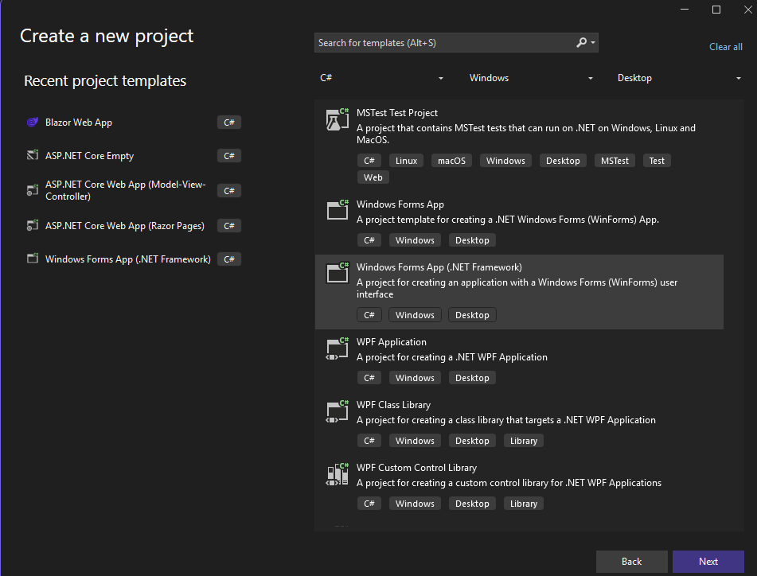
    
4. ตั้งชื่อโปรเจกต์
=======
   
    
    
5. ตั้งชื่อโปรเจกต์
>>>>>>> db2557064f5c72908d6a3fab14c61d0d337c7822

   ```text
   HRWinFormApp
   ```
6. กด Create

---

## ขั้นตอนที่ 2: โครงสร้างฟอร์ม (Main Form Layout)

### ฟอร์มหลัก (Form1)

กำหนดคุณสมบัติ

* Name: `FrmMain`
* Text: `HR Management System`
* StartPosition: `CenterScreen`
* Size: `900 x 600`

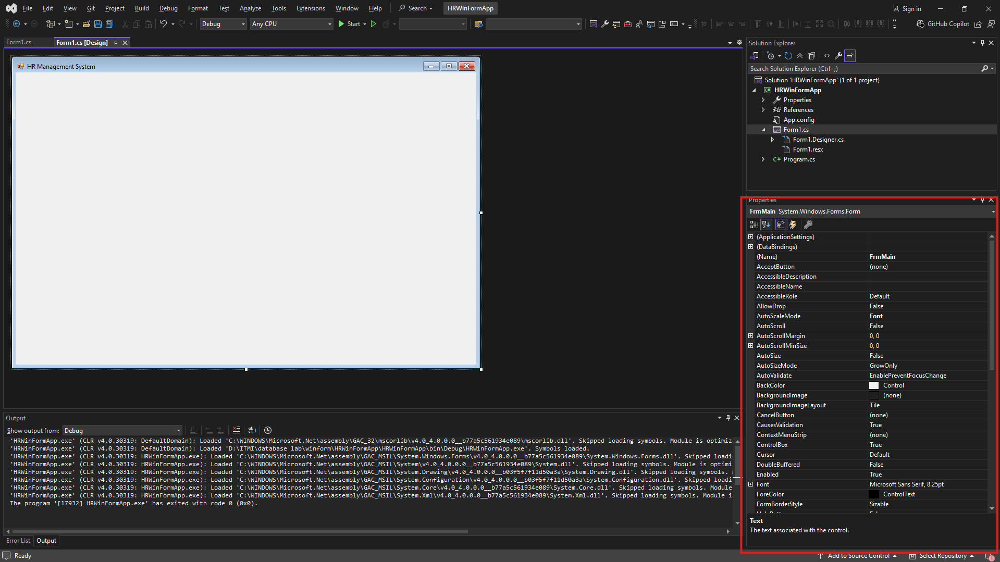

---

## ขั้นตอนที่ 3: Layout ด้วย Panel

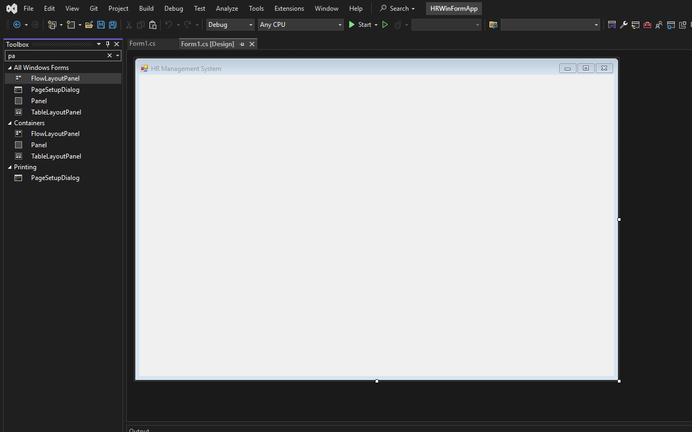

### Panel หลัก main


* Name: `panMain`
* เลือก `Dock in parent container`

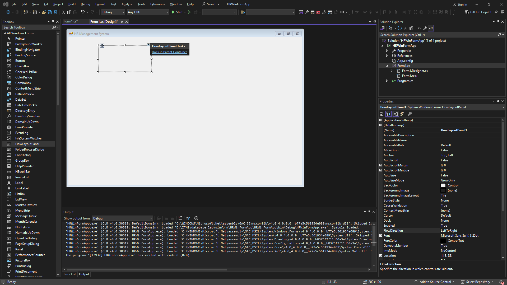
---

### Panel ด้านซ้าย (Menu)


* Name: `panMenu`
* จัดตำแหน่งตามรูป

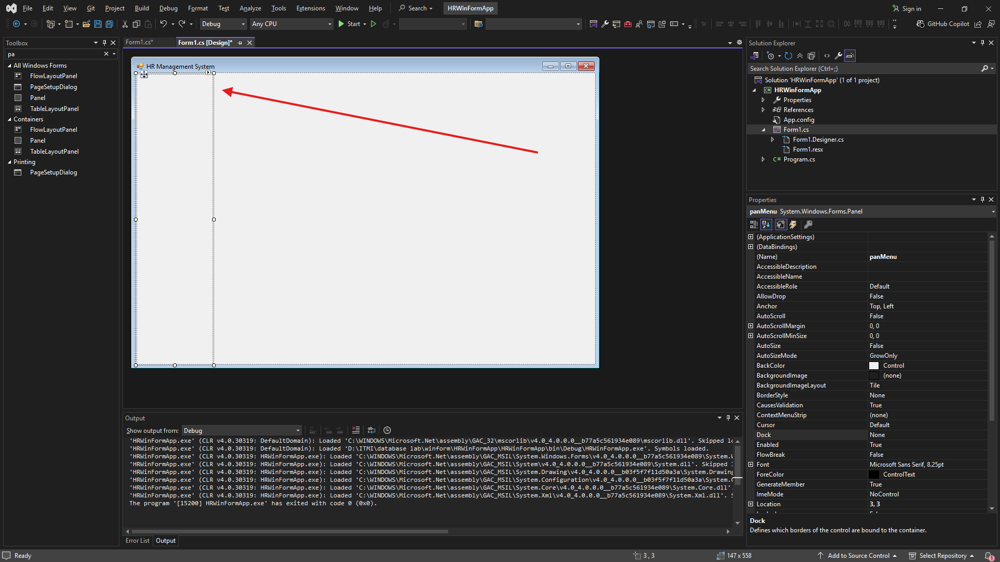

เพิ่มปุ่มเมนู และสี

* Button: `btnMeuEmp` → Text: Employees
* Button: `btnMeuDep` → Text: Departments
* Button: `btnMeuJob` → Text: Jobs

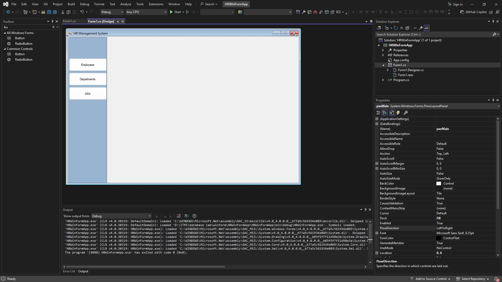
---

### Panel เนื้อหา (Content)


* Name: `panContent`
* จัดตำแหน่งตามรูป

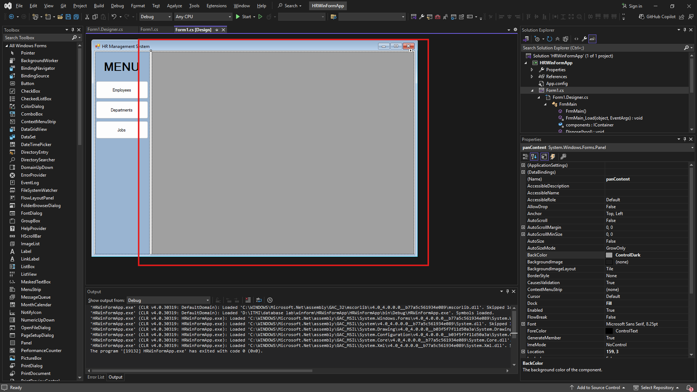
---

### Panel เนื้อหาย่อย (Sub Content)

* Sub Content คือเนื้อหาย่อยๆ ที่อยู่ใน Panel ของ ตัวเอง และวางอยู่ บน Panel Content โดยจะมีเนื่อหาได้มากกว่า 1 Panel ใน Panel Content 
* ให้เพิ่ม 3 Panel
    - Name: `panEmp`
    - Name: `panDep`
    - Name: `panJob`

    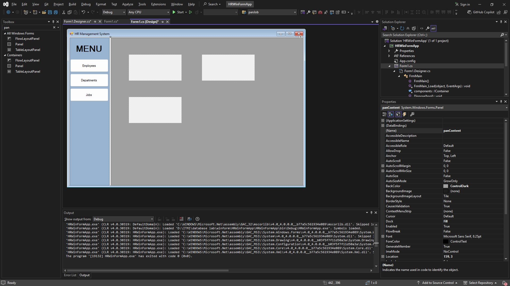
    
* ใส่ label ให้ Panel panEmp โดยต้อง เลือก Panal ขึ้นมาก่อน

    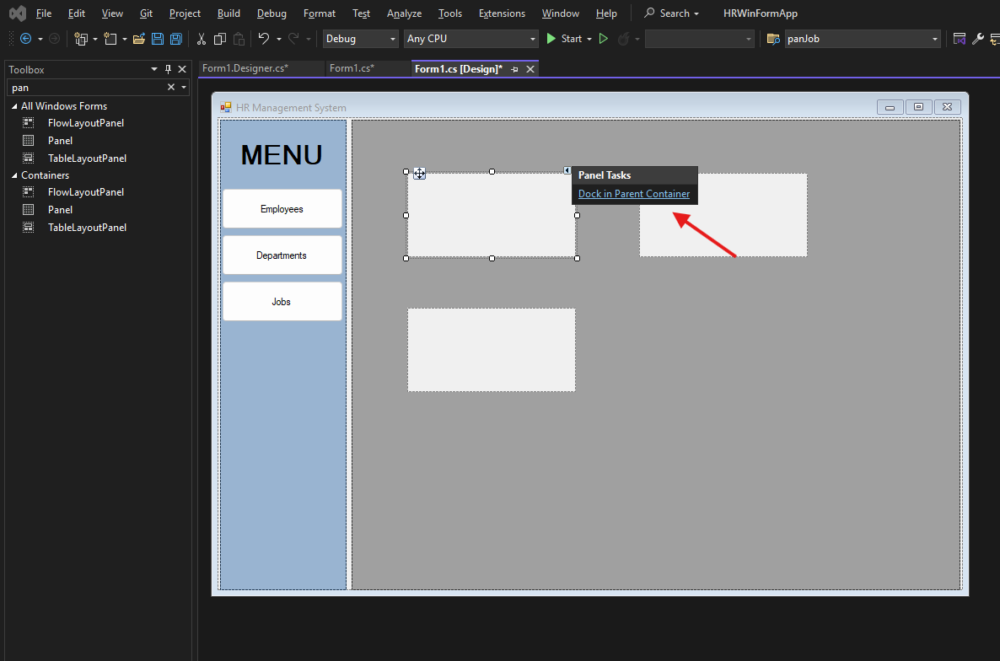

    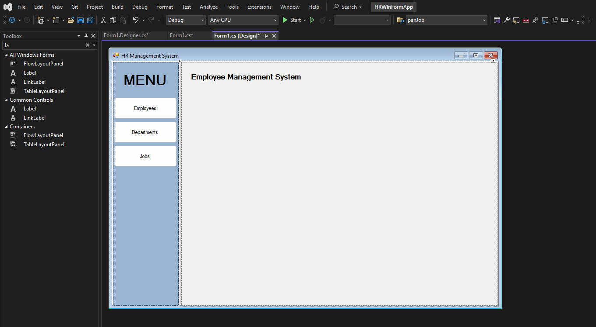


* ถ้าต้องการจะย่อให้เล็กลง ให้ทำตามภาพ

    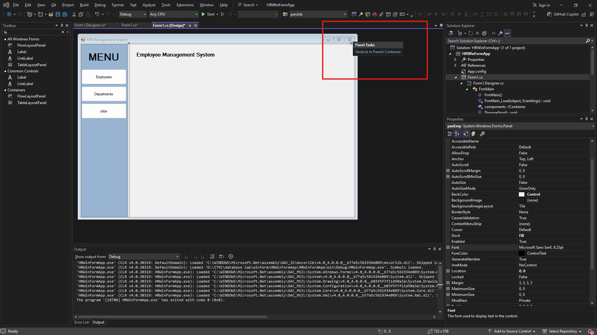

ทำต่อให้ครบทุก panel
---

## ขั้นตอนที่ 4: เขียนโปรแกรมจัดการ Panel
* ปิดการแสดงผลเมื่อเริ่มโปรแกรม

    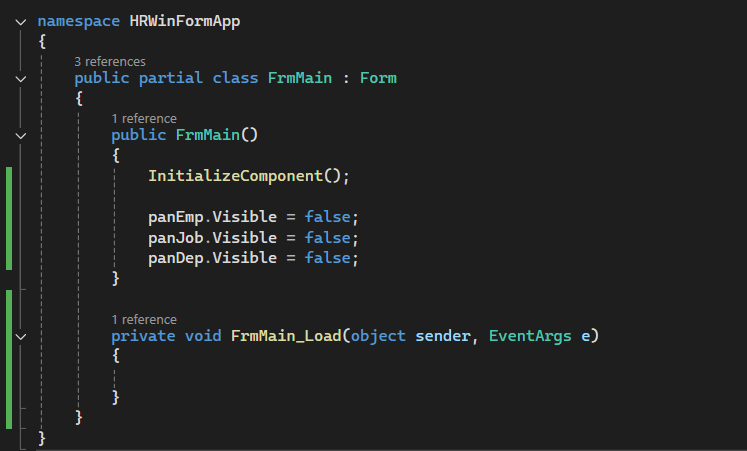

* เมื่อกดปุ่มให้แสดงผล เมนู ตามที่กด

    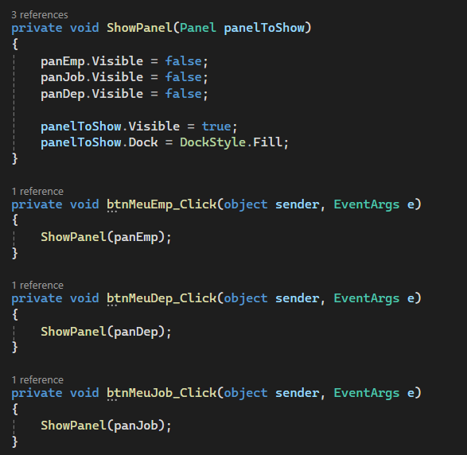
---

## ขั้นตอนที่ 5 การเรีบก Form มาแสดง ใน panel

สร้าง Form ใหม่ 
* Form: `FRMJOB` 

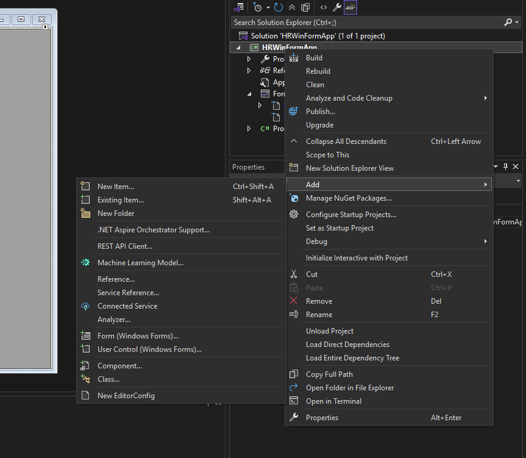

* เลือก Form(windowsform)

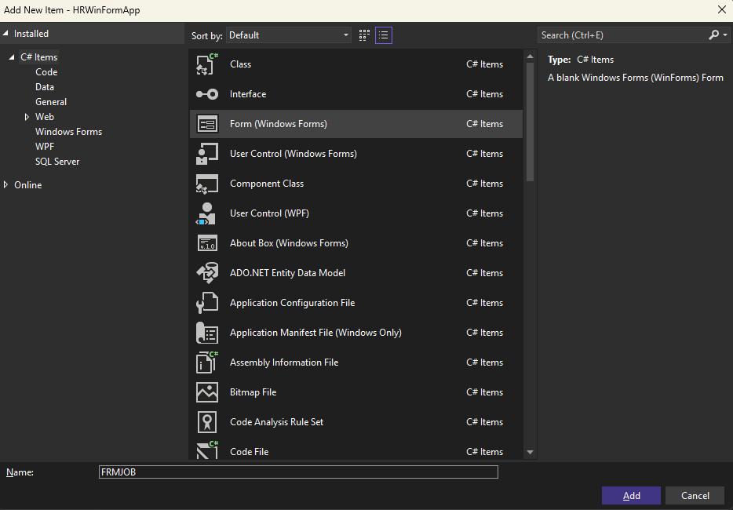

* เช็คขนาดของ panel panContent

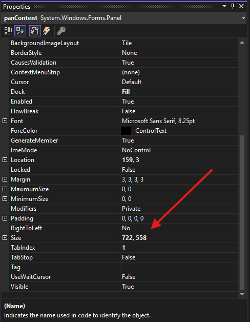

* ปรับขนาดของ Form FRMJOB ให้เท่ากับ panContent
* เพิ่ม label ใน Form FRMJOB


เพิ่มปุ่มใน form1 ชื่อ `btnjobfrm`

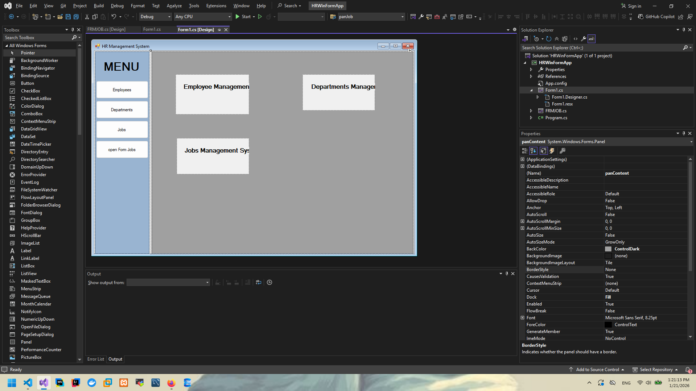


## ขั้นตอนที่ 6: เขียนโปรแกรมจัดการ Form

* เขียนโปรแกรมจัดการปุ่ม ให้เปิด form

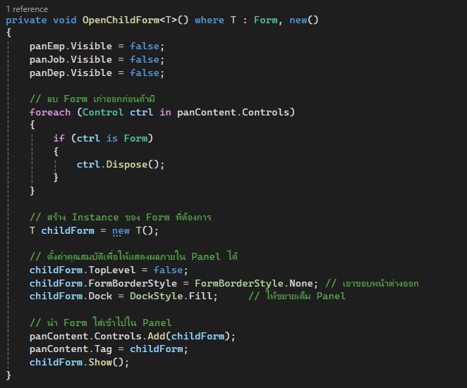
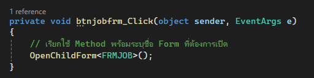

* ปรับ code เพิ่ม เพื่อให้ การจัดการ panel ยังใช้งานได้

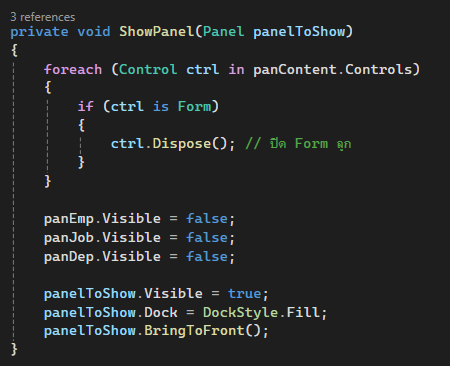

## ขั้นตอนที่ 7: Clean Code ให้อ่านง่าย
แก้ไขตามภาพ
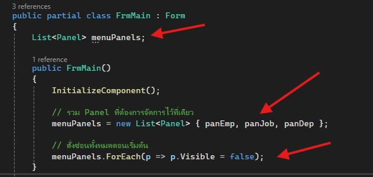
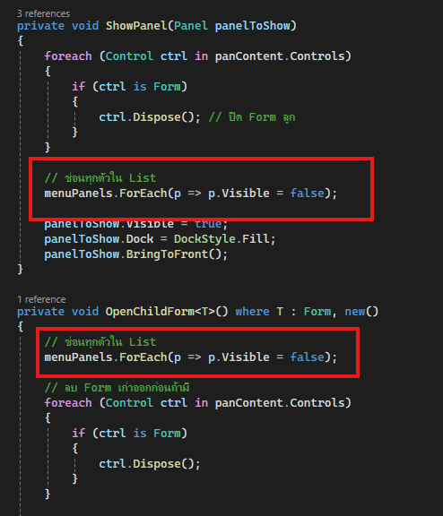
