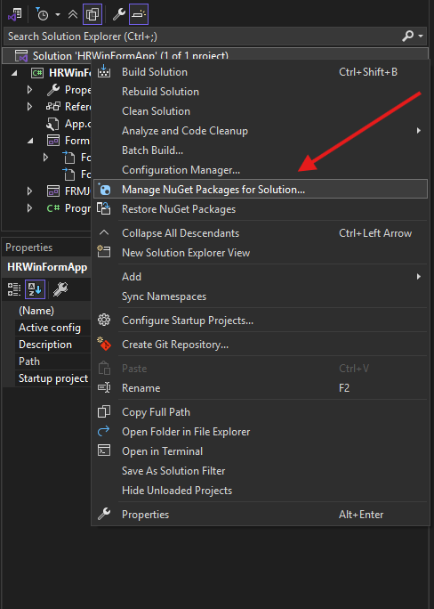
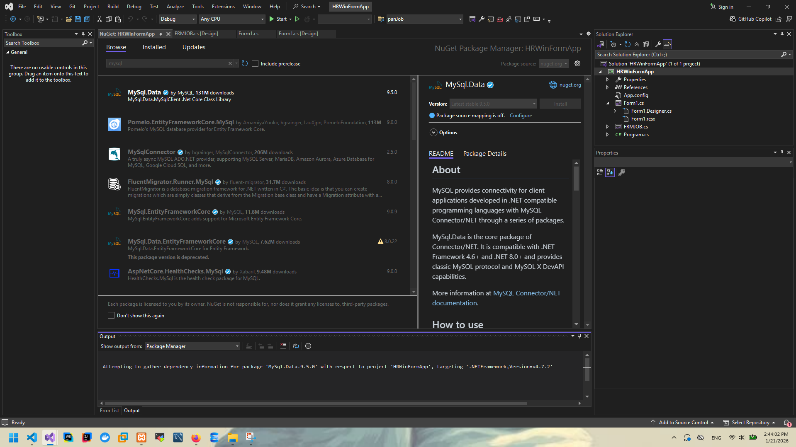
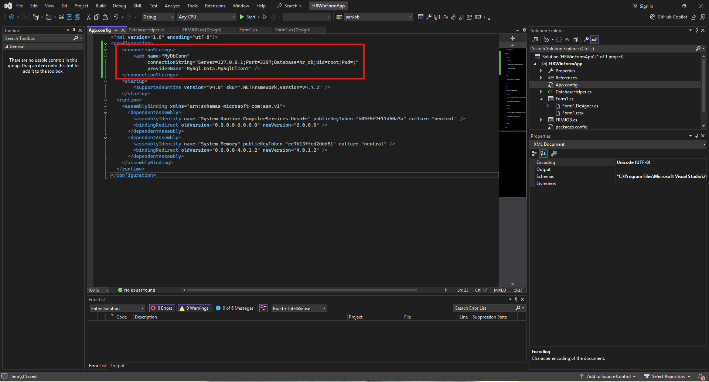
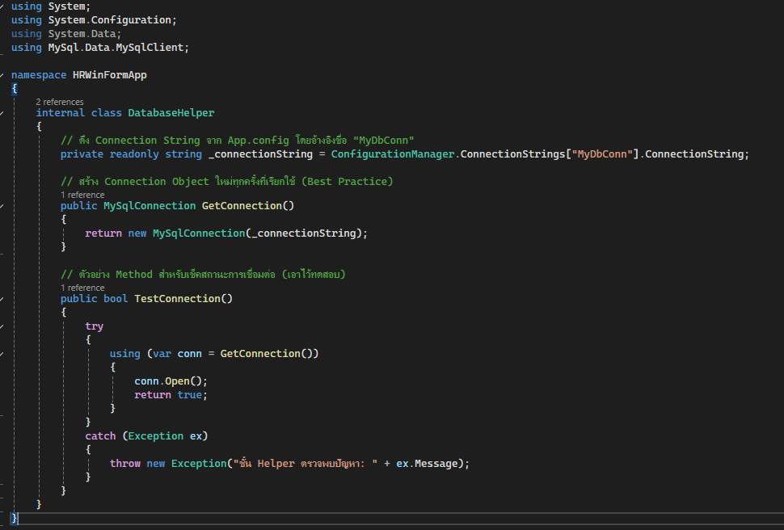
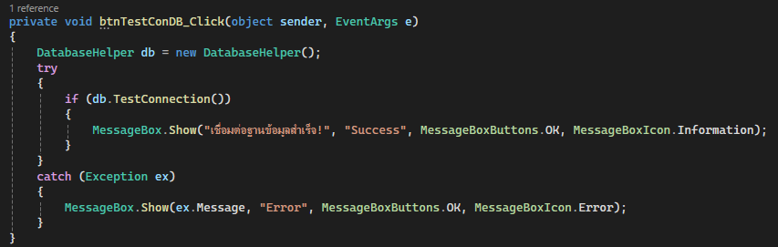
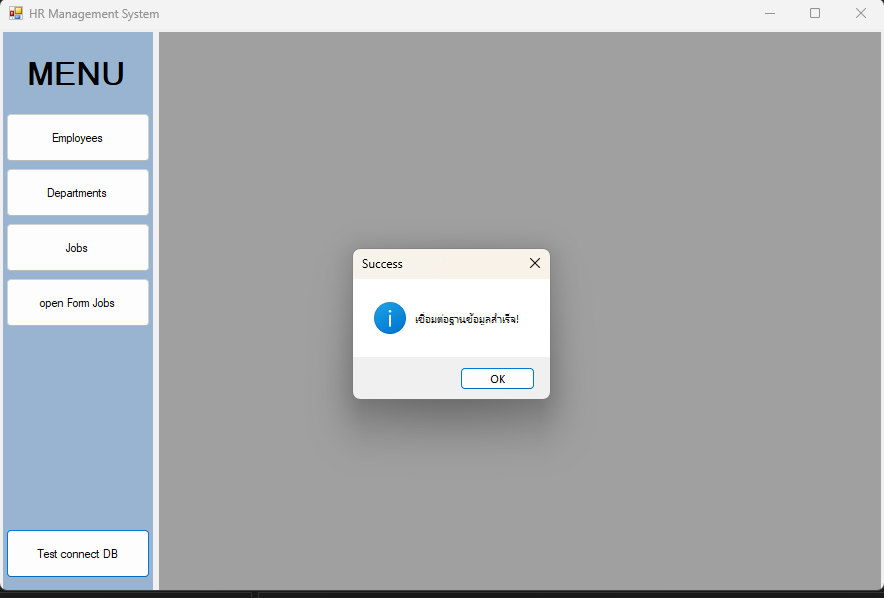

# Lab 03: C# Windows Forms Connect database

## รายวิชา

On-Premise and Off-Premise Relational Database Management

---


## ขั้นตอนที่ 1: ติดตั้ง NuGet Package

ติดตั้ง ชื่อแพ็กเกจ:` MySql.Data`




หรือ ติดตังผ่าน Package Manager Console

```shell
Install-Package MySql.Data
```

---

## เขียน ไฟล์ connect database 

สร้างไฟล์ใหม่เป็น class ชื่อ `DatabaseHelper.cs`
เพิ่มตามภาพ ในไฟล์ App.config



เขียน code ใน ไฟล์ `DatabaseHelper.cs`



เพิ่มปุ่ม ใน form1 สำหรับการทดสอบการเชื่อมต่อ
เขียน code ให้กับปุ่ม



Run โปรแกรมทดสอบ ลองกดปุ่ม

