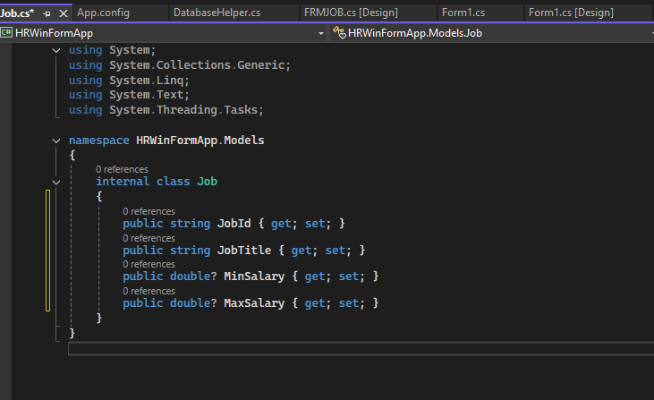
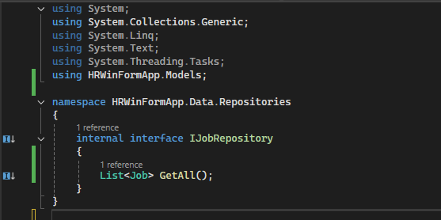
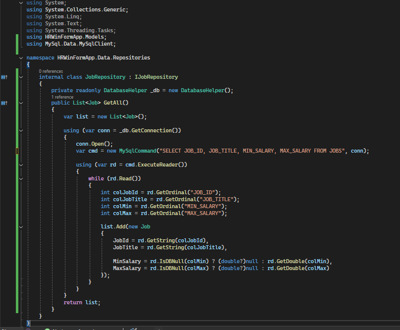
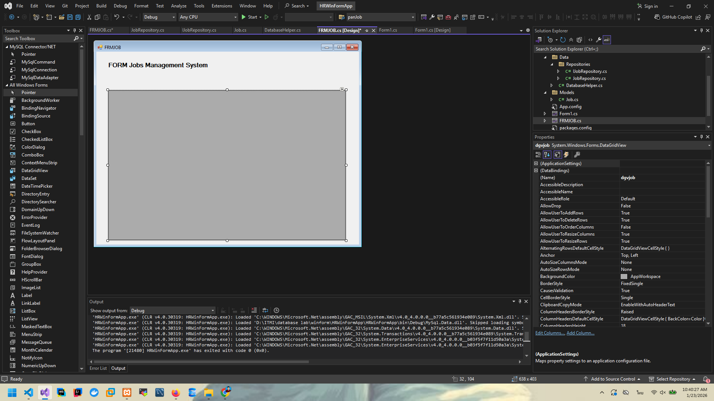
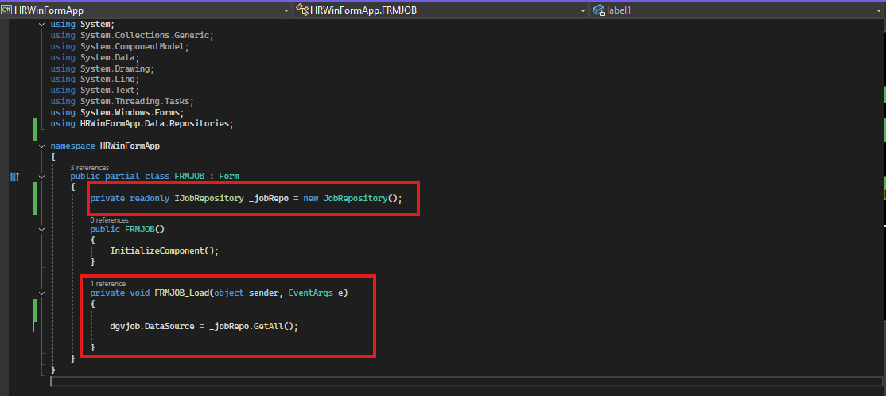
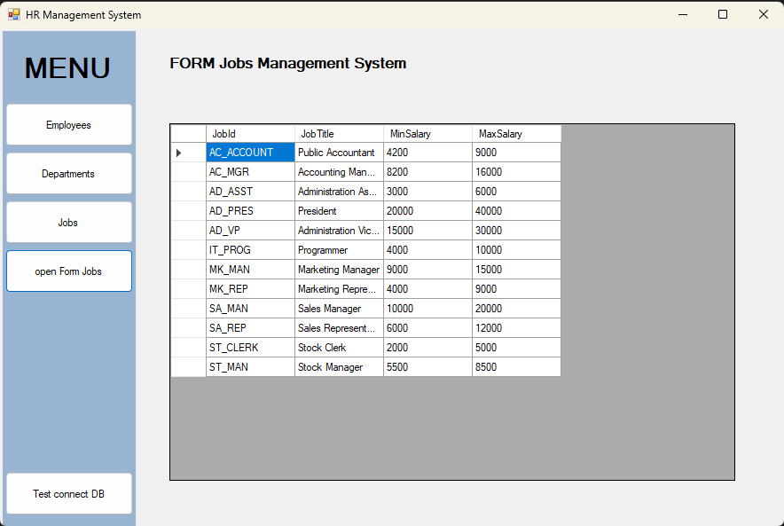
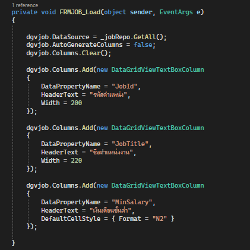
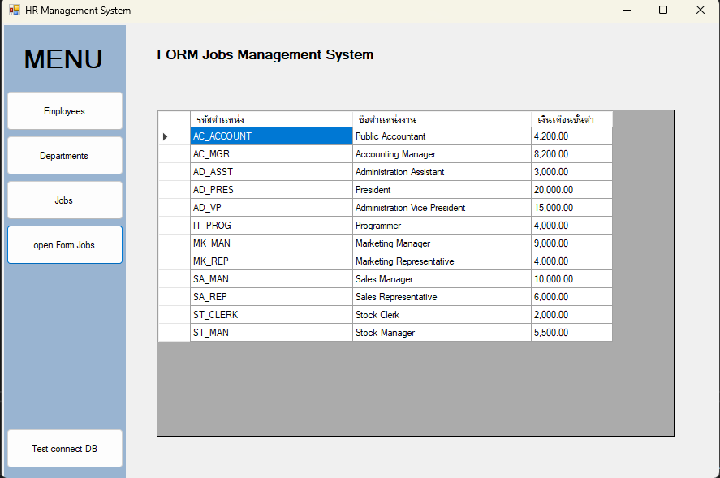

# Lab 02: C# Windows Forms Loda data from DB

## รายวิชา

On-Premise and Off-Premise Relational Database Management

---

## ขั้นตอนที่ 1: สร้าง folder Models เพื่อเก็บไฟล์ Models

* สร้าง folder Models
* สร้าง class Job

## ขั้นตอนที่ 2: สร้าง folder Data สำหรับเก็บเารื่องการจัดการกับข้อมูล

* สร้าง folder Data

* ย้าย  ไฟล์ `DatabaseHelper.cs` มาเก็บใน folder Data

* สร้าง folder Repositories ใน `Data`
* สร้าง interface  ชื่อ `IJobRepository`

* สร้าง class ชื่อ `JobRepository` 

## ขั้นตอนที่ 2: ใช้ dataGridView ในการแสดงข้อมูล
* เพิ่ม dataGridView ใน form job

* เอาข้อมูลมาแสดงใน dataGridView

* ผลการทำงาน dataGridView

* การปรับแต่ง dataGridView

