# Lab 05: C# Windows Forms Search data

## รายวิชา

On-Premise and Off-Premise Relational Database Management

---


## ขั้นตอนที่ 1: สร้าง Forms ใหม่

* สร้าง Forms ใหม่ ชื่อ `FRMEMP`

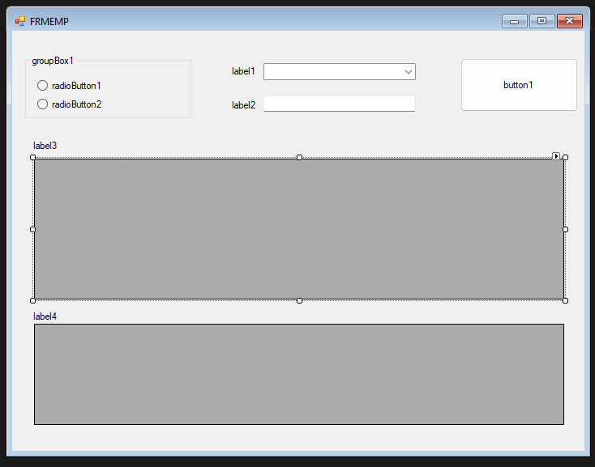

# รายละเอียดส่วนติดต่อผู้ใช้ (User Interface)
---

## Button
- **Name:** `btnSearch`
- **Text:** `ค้นหา`
- **Description:**  
  ปุ่มใช้ในการค้นหาข้อมูลพนักงาน

---

## TextBox
- **Name:** `txtEmpId`
- **Visible:** `False`
- **MaxLength:** `6`
- **Description:**  
  ใช้สำหรับกรอกรหัสพนักงาน โดยซ่อนการแสดงผล TextBox และจำกัดความยาวข้อมูลไม่เกิน 6 ตัวอักษร

---

## ComboBox
- **Name:** `cbbDep`
- **DropDownStyle:** `DropDownList`
- **Description:**  
  ใช้สำหรับเลือกแผนกจากรายการที่กำหนดไว้ ไม่สามารถพิมพ์ค่าเองได้

---

## GroupBox
- **Name:** `gbSer`
- **Text:** `ค้นหาโดย`
- **Description:**  
  ใช้จัดกลุ่มตัวเลือกเงื่อนไขในการค้นหาข้อมูลพนักงาน

### RadioButton ภายใน GroupBox

1. **RadioButton**
   - **Name:** `rdoNameDep`
   - **Text:** `ชื่อแผนก`
   - **Checked:** `True`
   - **Description:**  
     ใช้ค้นหาข้อมูลพนักงานโดยอ้างอิงจากชื่อแผนก (ค่าเริ่มต้น)

2. **RadioButton**
   - **Name:** `rdoEmpId`
   - **Text:** `รหัสพนักงาน`
   - **Checked:** `True`
   - **Description:**  
     ใช้ค้นหาข้อมูลพนักงานโดยอ้างอิงจากรหัสพนักงาน

---

## DataGridView
1. **DataGridView**
   - **Name:** `dgvEmp`
   - **Description:**  
     ใช้แสดงข้อมูลพนักงาน

2. **DataGridView**
   - **Name:** `dgvJobHis`
   - **Description:**  
     ใช้แสดงประวัติการทำงาน (Job History) ของพนักงาน
---

* ปรับ code ใน form1 เพื่อเปิด form FRMEMP

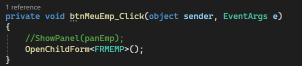

* ผลการทำงาน

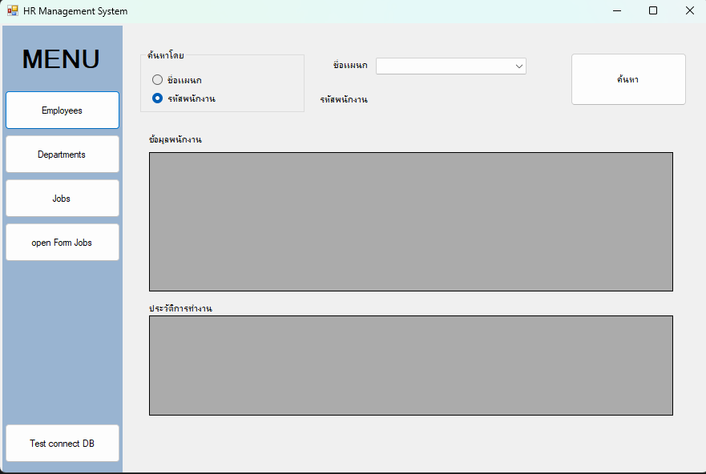

## ขั้นตอนที่ 2: เขียนโปรแกรมจัดการ Forms 

* เลือก  rdoNameDep  ตามขั้นตอนในภาพ

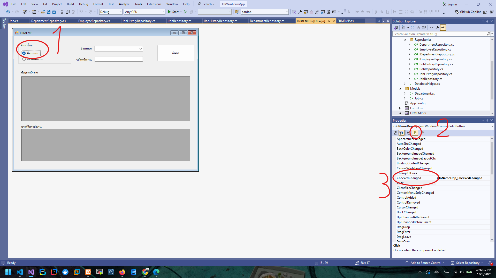

* เขียนโปรแกรมตามภาพ

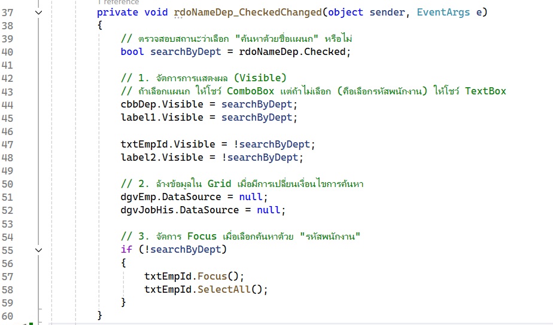

* เขียนโปรแกรม ดึงข้อมูลเข้า ComboBox
* สร้าง class Department ใน floder models

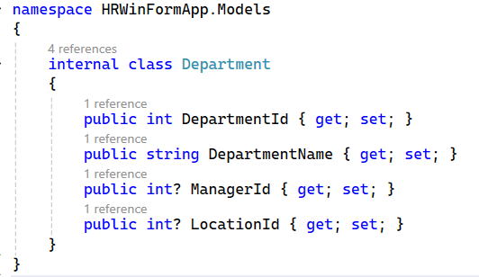


* สร้าง interface ชื่อ IDepartmentRepository  ใน Folder Repositories

```cs
internal interface IDepartmentRepository
{
    List<Department> GetAll();
}
```
* สร้าง class ชื่อ DepartmentRepository ใน Folder Repositories

```cs
internal class DepartmentRepository : IDepartmentRepository
{
    private readonly DatabaseHelper _db = new DatabaseHelper();

    public List<Department> GetAll()
    {
        var list = new List<Department>();

        using (var conn = _db.GetConnection())
        {
            conn.Open();
            var cmd = new MySqlCommand(
                "SELECT DEPARTMENT_ID, DEPARTMENT_NAME, MANAGER_ID, LOCATION_ID FROM DEPARTMENTS",conn);

            using (var rd = cmd.ExecuteReader())
            {
                int colId = rd.GetOrdinal("DEPARTMENT_ID");
                int colName = rd.GetOrdinal("DEPARTMENT_NAME");
                int colMgr = rd.GetOrdinal("MANAGER_ID");
                int colLoc = rd.GetOrdinal("LOCATION_ID");

                while (rd.Read())
                {
                    list.Add(new Department
                    {
                        DepartmentId = rd.GetInt32(colId),
                        DepartmentName = rd.GetString(colName),
                        ManagerId = rd.IsDBNull(colMgr) ? (int?)null : rd.GetInt32(colMgr),
                        LocationId = rd.IsDBNull(colLoc) ? (int?)null : rd.GetInt32(colLoc)
                    });
                }
            }
        }
        return list;
    }

}
```
* เอาข้อมูลไปแสดงใน combobox

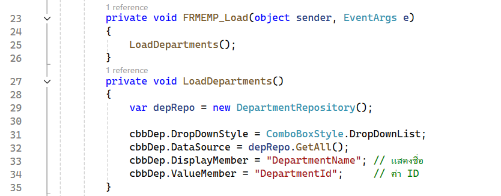


* ผลการทำงานโปรแกรม

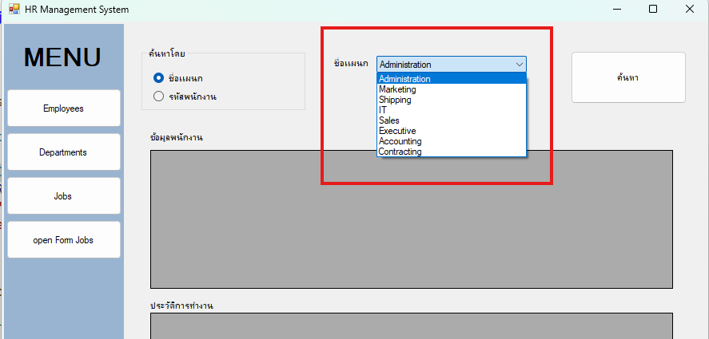

* สร้าง folder DTO ใน floder Data และสร้าง class EmployeeSearchView

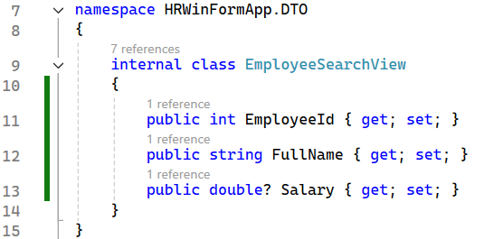

* สร้าง interface ชื่อ IEmployeeRepository ใน Folder Repositories

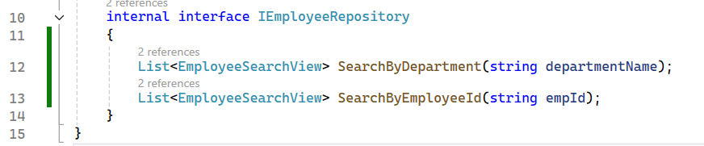

* สร้าง class ชื่อ EmployeeRepository ใน Folder Repositories

```cs
internal class EmployeeRepository : IEmployeeRepository
{
    private readonly DatabaseHelper _db = new DatabaseHelper();

    public List<EmployeeSearchView> SearchByDepartment(string departmentName)
    {
        const string sql = @"
            SELECT e.employee_id,
                    CONCAT(e.first_name,' ',e.last_name) AS full_name,
                    e.salary
            FROM employees e
            JOIN departments d ON e.department_id = d.department_id
            WHERE d.department_name = @DeptName";

        return ExecuteSearch(sql, cmd =>
            cmd.Parameters.AddWithValue("@DeptName", departmentName));
    }

    public List<EmployeeSearchView> SearchByEmployeeId(string empId)
    {
        const string sql = @"
            SELECT e.employee_id,
                    CONCAT(e.first_name,' ',e.last_name) AS full_name,
                    e.salary
            FROM employees e
            JOIN departments d ON e.department_id = d.department_id
            WHERE e.employee_id LIKE @EmpId";

        return ExecuteSearch(sql, cmd =>
            cmd.Parameters.AddWithValue("@EmpId", "%" + empId + "%"));
    }

    private List<EmployeeSearchView> ExecuteSearch(
        string sql,
        System.Action<MySqlCommand> parameterAction)
    {
        var list = new List<EmployeeSearchView>();

        using (var conn = _db.GetConnection())
        {
            conn.Open();
            using (var cmd = new MySqlCommand(sql, conn))
            {
                parameterAction(cmd);

                using (var rd = cmd.ExecuteReader())
                {
                    int colId = rd.GetOrdinal("employee_id");
                    int colName = rd.GetOrdinal("full_name");
                    int colSalary = rd.GetOrdinal("salary");

                    while (rd.Read())
                    {
                        list.Add(new EmployeeSearchView
                        {
                            EmployeeId = rd.GetInt32(colId),
                            FullName = rd.GetString(colName),
                            Salary = rd.IsDBNull(colSalary)
                                ? (double?)null
                                : rd.GetDouble(colSalary)
                        });
                    }
                }
            }
        }
        return list;
    }
}

```

 * ใน form FRMEMP ให้ ทำการ  สร้าง Instance ของ EmployeeRepository ไว้ใน class FRMEMP

 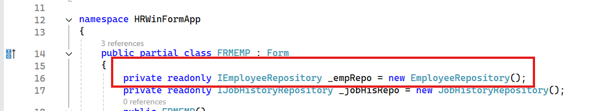

* เขียนโปรแกรมสำหรับกดปุ่มค้นหา 

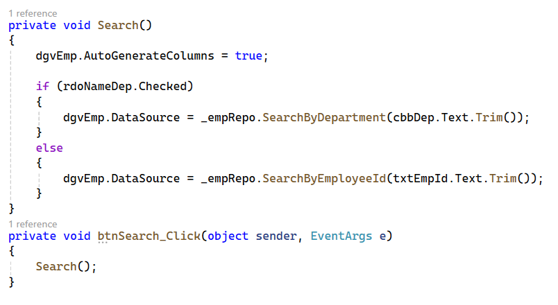

* ผลการทำงาน

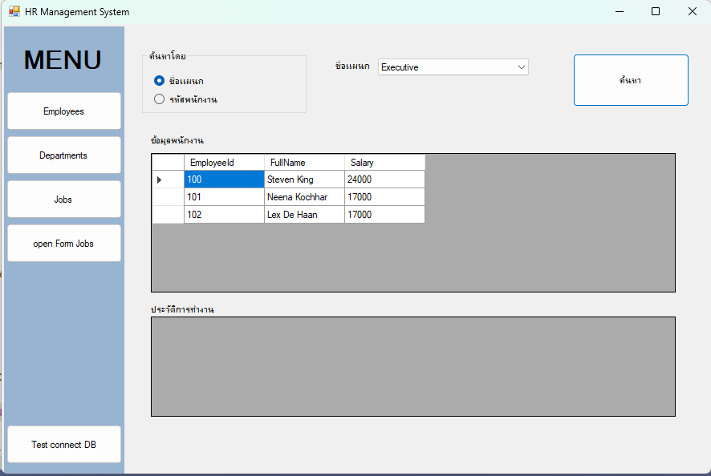


* สร้าง class ชื่อ JobHistoryDto ใน Folder DTO

```cs
internal class JobHistoryDto
{
    public DateTime StartDate { get; set; }
    public DateTime EndDate { get; set; }
    public string JobId { get; set; }
    public int DepartmentId { get; set; }
}
```

* สร้าง interface ชื่อ IJobHistoryRepository ใน Folder Repositories

```cs
internal interface IJobHistoryRepository
{
    List<JobHistoryDto> GetByEmployeeId(int employeeId);
}
```

* สร้าง class ชื่อ JobHistoryRepository ใน Folder Repositories

```cs
 internal class JobHistoryRepository : IJobHistoryRepository
 {
     private readonly DatabaseHelper _db = new DatabaseHelper();

     public List<JobHistoryDto> GetByEmployeeId(int employeeId)
     {
         var list = new List<JobHistoryDto>();
         string sql = "SELECT start_date, end_date, job_id, department_id FROM job_history WHERE employee_id = @EmpId";

         using (var conn = _db.GetConnection())
         {
             conn.Open();
             using (var cmd = new MySqlCommand(sql, conn))
             {
                 cmd.Parameters.AddWithValue("@EmpId", employeeId);

                 using (var rd = cmd.ExecuteReader())
                 {
                     while (rd.Read())
                     {
                         list.Add(new JobHistoryDto
                         {
                             StartDate = rd.GetDateTime("start_date"),
                             EndDate = rd.GetDateTime("end_date"),
                             JobId = rd.GetString("job_id"),
                             DepartmentId = rd.GetInt32("department_id")
                         });
                     }
                 }
             }
         }
         return list;
     }
 }
 ```

 * ใน form FRMEMP ให้ ทำการ  สร้าง Instance ของ JobHistoryRepository ไว้ใน class FRMEMP


 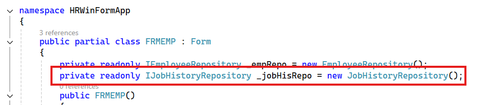

* เลือก dgvEmp แล้วไปที่ event รูปสายฟ้า เลือก CellClick

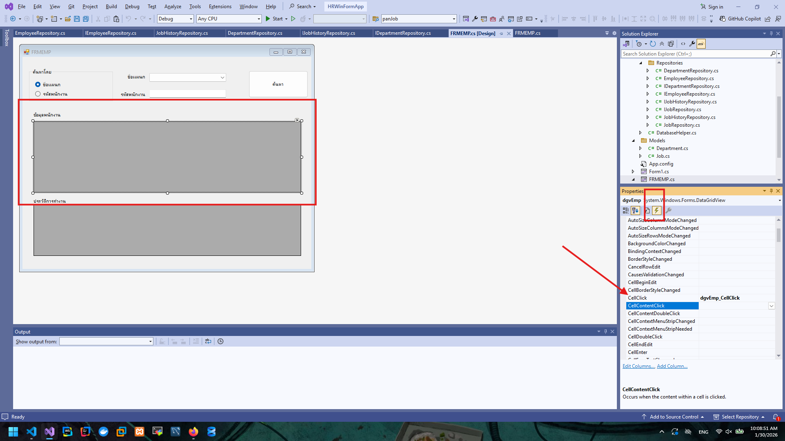

 * เขียนโปรแกรมจัดการ event 

 ```cs
private void dgvEmp_CellClick(object sender, DataGridViewCellEventArgs e)
{
    if (e.RowIndex < 0) return;

    var empId = (int)dgvEmp.Rows[e.RowIndex]
                    .Cells["EmployeeId"].Value;

    dgvJobHis.DataSource = _jobHisRepo.GetByEmployeeId(empId);
}
```

*ผลการทำงานเมื่อกด ที่ cell ข้อมูลพนักงาน

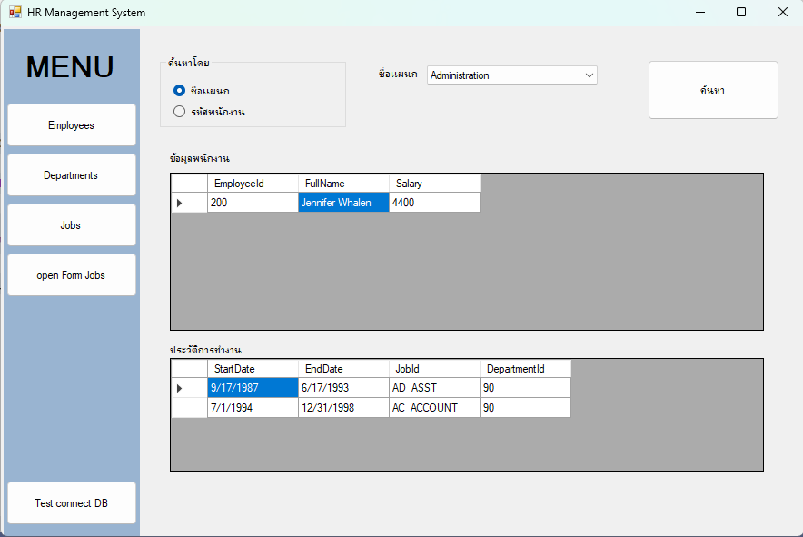