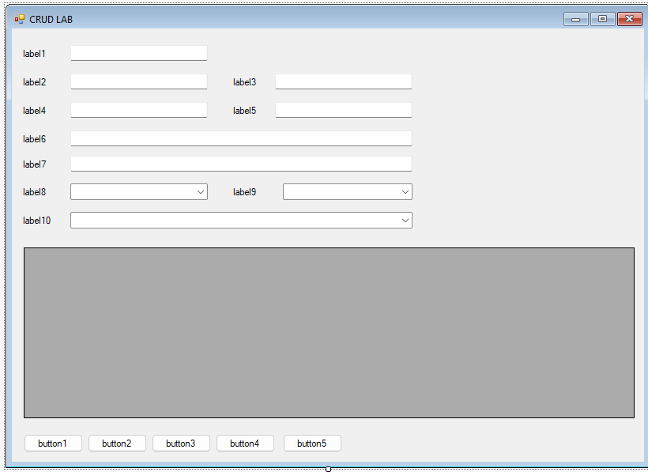
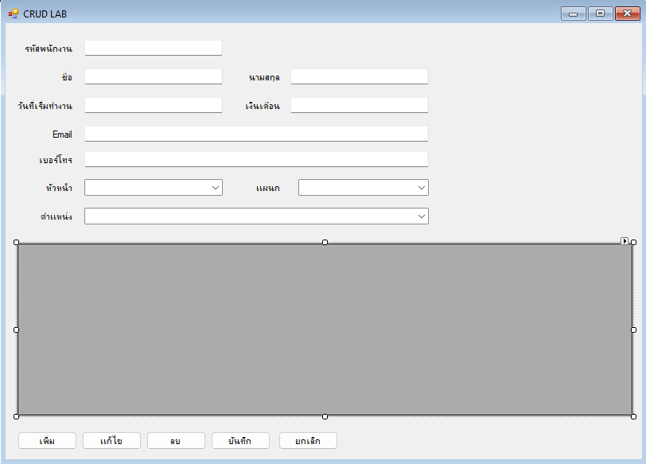
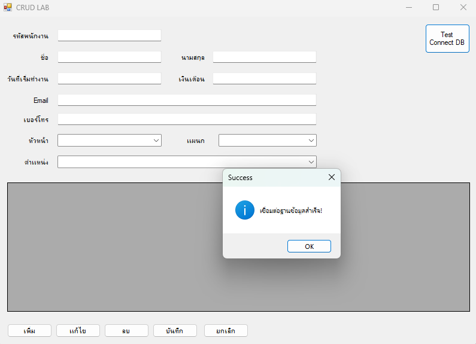
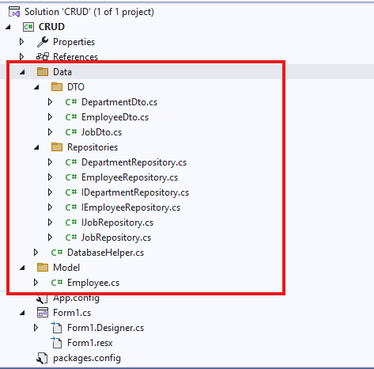

# Lab 05: C# CRUD

## รายวิชา

On-Premise and Off-Premise Relational Database Management

---


## ขั้นตอนที่ 1: สร้าง Project ใหม่

* ออกแบบ form ตามภาพ



## ส่วนที่ 1: Labels

### Label1
- Property
  - Name: label1
  - Text: รหัสพนักงาน

### Label2
- Property
  - Name: label2
  - Text: ชื่อ

### Label3
- Property
  - Name: label3
  - Text: นามสกุล

### Label4
- Property
  - Name: label4
  - Text: วันที่เริ่มทำงาน

### Label5
- Property
  - Name: label5
  - Text: เงินเดือน

### Label6
- Property
  - Name: label6
  - Text: Email

### Label7
- Property
  - Name: label7
  - Text: เบอร์โทร

### Label8
- Property
  - Name: label8
  - Text: หัวหน้า

### Label9
- Property
  - Name: label9
  - Text: แผนก

### Label10
- Property
  - Name: label10
  - Text: ตำแหน่ง


---

## ส่วนที่ 2: TextBox

### TextBox1
- Property
  - Name: tbSsn
  - Text: null

### TextBox2
- Property
  - Name: tbFName
  - Text: null

### TextBox3
- Property
  - Name: tbLName
  - Text: null

### TextBox4
- Property
  - Name: tbHDate
  - Text: null

### TextBox5
- Property
  - Name: tbSalary
  - Text: null

### TextBox6
- Property
  - Name: tbEmail
  - Text: null

### TextBox7
- Property
  - Name: tbTel
  - Text: null


---

## ส่วนที่ 3: ComboBox

### ComboBox1
- Property
  - Name: cbManager
  - Text: null
  - DropDownStyle: DropDownList

### ComboBox2
- Property
  - Name: cbDept
  - Text: null
  - DropDownStyle: DropDownList

### ComboBox3
- Property
  - Name: cbJob
  - Text: null
  - DropDownStyle: DropDownList


---

## ส่วนที่ 4: Buttons

### Button1
- Property
  - Name: btnAdd
  - Text: เพิ่ม

### Button2
- Property
  - Name: btnEdit
  - Text: แก้ไข

### Button3
- Property
  - Name: btnDelete
  - Text: ลบ

### Button4
- Property
  - Name: btnSave
  - Text: บันทึก

### Button5
- Property
  - Name: btnCancel
  - Text: ยกเลิก


---

## ส่วนที่ 5: DataGridView

### DataGridView1
- Property
  - Name: dataGridView1


---

## หมายเหตุ
- ComboBox ใช้ DropDownList เพื่อป้องกันการพิมพ์ค่าที่ไม่ถูกต้อง
- TextBox กำหนดค่าเริ่มต้นเป็นค่าว่าง (null)
- ปุ่มใช้งานสำหรับ CRUD Operation
  - เพิ่ม (Create)
  - แก้ไข (Update)
  - ลบ (Delete)
  - บันทึก (Save)
  - ยกเลิก (Cancel)

---
## ผลการทำงาน

  

## ขั้นตอนที่ 2: Connect database

* ทำตาม LAB 03-connect-DB

## ขั้นตอนที่ 3: Connect database

* ทำตาม LAB 03-connect-DB
* ทดสอบการเชื่อมต่อ

 

 ## ขั้นตอนที่ 3: เริ่ม เขียน โปรแกรม

* สร้างไฟล์ และ โฟลเดอร์ ตามภาพ 
* ไฟล์ ที่ มี ตัวอักษร I อยุ่ด้านหน้า ให้สร้างเป็น interface ส่วนไฟล์ อื่นเป็น class


 

 ```cs
     internal class DepartmentDto
    {
        public int DepartmentId { get; set; }
        public string DepartmentName { get; set; }
    }
```

```cs
internal class EmployeeDto
{
    public int EmployeeId { get; set; }
    public string FirstName { get; set; }
    public string LastName { get; set; }
    public decimal Salary { get; set; }
    public string Email { get; set; }
    public string PhoneNumber { get; set; }
    public int? ManagerId { get; set; }
    public int DepartmentId { get; set; }
    public string JobId { get; set; }
    public DateTime HireDate { get; set; }

    // สำหรับแสดงชื่อเต็มใน ComboBox
    public string FullName => $"{FirstName} {LastName}";
}
```

```cs
    internal class JobDto
    {
        public string JobId { get; set; }
        public string JobTitle { get; set; }
    }
```

```cs
internal interface IDepartmentRepository
{
    List<DepartmentDto> GetDepartments();
}
```

```cs
 internal class DepartmentRepository : IDepartmentRepository
 {
     private readonly DatabaseHelper _db = new DatabaseHelper();
     public List<DepartmentDto> GetDepartments()
     {
         var list = new List<DepartmentDto>();
         string sql = "SELECT department_id, department_name FROM departments";

         using (var conn = _db.GetConnection())
         {
             conn.Open();
             using (var cmd = new MySqlCommand(sql, conn))
             using (var rd = cmd.ExecuteReader())
             {
                 int colId = rd.GetOrdinal("department_id");
                 int colName = rd.GetOrdinal("department_name");

                 while (rd.Read())
                 {
                     list.Add(new DepartmentDto
                     {
                         DepartmentId = rd.GetInt32(colId),
                         DepartmentName = rd.GetString(colName)
                     });
                 }
             }
         }
         return list;
     }
 }
```


```cs
internal interface IEmployeeRepository
{
    List<EmployeeDto> GetAll();
    bool SaveOrUpdate(Employee emp);
    bool IsExists(int employeeId);
    bool HardDelete(int employeeId);
    bool HasReferenceData(int employeeId);
}
```

```cs
 internal class EmployeeRepository : IEmployeeRepository
 {
     private readonly DatabaseHelper _db = new DatabaseHelper();

     public List<EmployeeDto> GetAll()
     {
         var list = new List<EmployeeDto>();
         string sql = @"SELECT employee_id, first_name, last_name, salary, email, 
                        phone_number, manager_id, department_id, job_id, hire_date FROM employees";

         using (var conn = _db.GetConnection())
         {
             conn.Open();
             using (var cmd = new MySqlCommand(sql, conn))
             using (var rd = cmd.ExecuteReader())
             {
                 // หาลำดับ Index ของ Column ไว้ก่อนเข้า Loop
                 int colEmpId = rd.GetOrdinal("employee_id");
                 int colFName = rd.GetOrdinal("first_name");
                 int colLName = rd.GetOrdinal("last_name");
                 int colSalary = rd.GetOrdinal("salary");
                 int colEmail = rd.GetOrdinal("email");
                 int colPhone = rd.GetOrdinal("phone_number");
                 int colMgrId = rd.GetOrdinal("manager_id");
                 int colDeptId = rd.GetOrdinal("department_id");
                 int colJobId = rd.GetOrdinal("job_id");
                 int colHireDate = rd.GetOrdinal("hire_date");

                 while (rd.Read())
                 {
                     list.Add(new EmployeeDto
                     {
                         EmployeeId = rd.GetInt32(colEmpId),
                         FirstName = rd.GetString(colFName),
                         LastName = rd.GetString(colLName),
                         Salary = rd.GetDecimal(colSalary),
                         Email = rd.GetString(colEmail),
                         PhoneNumber = rd.IsDBNull(colPhone) ? null : rd.GetString(colPhone),
                         ManagerId = rd.IsDBNull(colMgrId) ? (int?)null : rd.GetInt32(colMgrId),
                         DepartmentId = rd.GetInt32(colDeptId),
                         JobId = rd.GetString(colJobId),
                         HireDate = rd.GetDateTime(colHireDate)
                     });
                 }
             }
         }
         return list;
     }

     public bool IsExists(int employeeId)
     {
         string sql = "SELECT COUNT(*) FROM employees WHERE employee_id = @EmpId";
         using (var conn = _db.GetConnection())
         {
             conn.Open();
             using (var cmd = new MySqlCommand(sql, conn))
             {
                 cmd.Parameters.AddWithValue("@EmpId", employeeId);
                 return Convert.ToInt32(cmd.ExecuteScalar()) > 0;
             }
         }
     }

     public bool SaveOrUpdate(Employee emp)
     {
         string sql;
         bool exists = IsExists(emp.EmployeeId);

         if (!exists)
         {
             // SQL สำหรับ INSERT
             sql = @"INSERT INTO employees (employee_id, first_name, last_name, hire_date, salary, email, phone_number, job_id, manager_id, department_id) 
             VALUES (@id, @fname, @lname, @hdate, @salary, @email, @phone, @job, @mgr, @dept)";
         }
         else
         {
             // SQL สำหรับ UPDATE
             sql = @"UPDATE employees SET first_name=@fname, last_name=@lname, hire_date=@hdate, salary=@salary, 
             email=@email, phone_number=@phone, job_id=@job, manager_id=@mgr, department_id=@dept 
             WHERE employee_id=@id";
         }

         using (var conn = _db.GetConnection())
         {
             conn.Open();
             using (var cmd = new MySqlCommand(sql, conn))
             {
                 cmd.Parameters.AddWithValue("@id", emp.EmployeeId);
                 cmd.Parameters.AddWithValue("@fname", emp.FirstName);
                 cmd.Parameters.AddWithValue("@lname", emp.LastName);
                 cmd.Parameters.AddWithValue("@hdate", emp.HireDate);
                 cmd.Parameters.AddWithValue("@salary", emp.Salary);
                 cmd.Parameters.AddWithValue("@email", emp.Email);
                 cmd.Parameters.AddWithValue("@phone", emp.PhoneNumber);
                 cmd.Parameters.AddWithValue("@job", emp.JobId);
                 cmd.Parameters.AddWithValue("@mgr", (object)emp.ManagerId ?? DBNull.Value);
                 cmd.Parameters.AddWithValue("@dept", emp.DepartmentId);

                 return cmd.ExecuteNonQuery() > 0;
             }
         }
     }

     public bool HardDelete(int employeeId)
     {
         // ใช้คำสั่ง DELETE เพื่อลบข้อมูลออกจากตารางจริงๆ
         string sql = "DELETE FROM employees WHERE employee_id = @id";

         using (var conn = _db.GetConnection())
         {
             conn.Open();
             using (var cmd = new MySqlCommand(sql, conn))
             {
                 cmd.Parameters.AddWithValue("@id", employeeId);
                 return cmd.ExecuteNonQuery() > 0;
             }
         }
     }

     public bool HasReferenceData(int employeeId)
     {
         // เช็คว่ามีข้อมูลพนักงานคนนี้ไปปรากฏในตารางที่มี FK หรือไม่ (ตัวอย่างเช่น job_history)
         string sql = "SELECT COUNT(*) FROM job_history WHERE employee_id = @id";
         using (var conn = _db.GetConnection())
         {
             conn.Open();
             using (var cmd = new MySqlCommand(sql, conn))
             {
                 cmd.Parameters.AddWithValue("@id", employeeId);
                 return Convert.ToInt32(cmd.ExecuteScalar()) > 0;
             }
         }
     }
 }
```

```cs
    internal interface IJobRepository
    {
        List<JobDto> GetJobs();
    }
```

```cs
internal class JobRepository: IJobRepository
{
    private readonly DatabaseHelper _db = new DatabaseHelper();
    public List<JobDto> GetJobs()
    {
        var list = new List<JobDto>();
        string sql = "SELECT job_id, job_title FROM jobs";

        using (var conn = _db.GetConnection())
        {
            conn.Open();
            using (var cmd = new MySqlCommand(sql, conn))
            using (var rd = cmd.ExecuteReader())
            {
                int colId = rd.GetOrdinal("job_id");
                int colTitle = rd.GetOrdinal("job_title");

                while (rd.Read())
                {
                    list.Add(new JobDto
                    {
                        JobId = rd.GetString(colId),
                        JobTitle = rd.GetString(colTitle)
                    });
                }
            }
        }
        return list;
    }
}
```

```cs
internal class Employee
{
    public int EmployeeId { get; set; }
    public string FirstName { get; set; }
    public string LastName { get; set; }
    public string Email { get; set; }
    public string PhoneNumber { get; set; }
    public DateTime HireDate { get; set; }
    public string JobId { get; set; }
    public decimal Salary { get; set; }
    public int? ManagerId { get; set; }
    public int DepartmentId { get; set; }
}
```

```cs
public partial class Form1 : Form
{
    private readonly IEmployeeRepository _empRepo = new EmployeeRepository();
    private readonly IJobRepository _jobRepo = new JobRepository();
    private readonly IDepartmentRepository _depRepo = new DepartmentRepository();
    public Form1()
    {
        InitializeComponent();
    }
    private void Form1_Load(object sender, EventArgs e)
    {
        Clear_Data();
        SetScreenState(false);
        Refresh_Grid();
    }
    private void Refresh_Grid()
    {
        try
        {
            // 1. โหลดข้อมูลแผนก
            cbDept.DataSource = _depRepo.GetDepartments();
            cbDept.DisplayMember = "DepartmentName";
            cbDept.ValueMember = "DepartmentId";

            // 2. โหลดข้อมูลตำแหน่งงาน
            cbJob.DataSource = _jobRepo.GetJobs();
            cbJob.DisplayMember = "JobTitle";
            cbJob.ValueMember = "JobId";

            // 3. โหลดข้อมูลพนักงาน
            var employees = _empRepo.GetAll();

            // ใส่ใน ComboBox Manager (ใช้รายชื่อพนักงาน)
            cbManager.DataSource = new List<EmployeeDto>(employees); // สร้าง List ใหม่ป้องกันการแย่ง Focus/Binding กัน
            cbManager.DisplayMember = "FullName";
            cbManager.ValueMember = "EmployeeId";

            // ใส่ใน DataGridView
            dataGridView1.DataSource = employees;
        }
        catch (Exception ex)
        {
            MessageBox.Show("เกิดข้อผิดพลาดในการดึงข้อมูล: " + ex.Message);
        }
    }
    private void Clear_Data()
    {
        tbSsn.Clear();
        tbFName.Clear();
        tbLName.Clear();
        tbHDate.Clear();
        tbSalary.Clear();
        tbEmail.Clear();
        tbTel.Clear();
        cbManager.Text = "";
        cbDept.Text = "";
        cbJob.Text = "";
    }

    private void SetScreenState(bool status)
    {
        tbSsn.Enabled = status;
        tbFName.Enabled = status;
        tbLName.Enabled = status;
        tbHDate.Enabled = status;
        tbSalary.Enabled = status;
        tbEmail.Enabled = status;
        tbTel.Enabled = status;
        cbManager.Enabled = status;
        cbDept.Enabled = status;
        cbJob.Enabled = status;
        dataGridView1.Enabled = true;      
        dataGridView1.ReadOnly = !status;
    }

    private void btTestConDB_Click(object sender, EventArgs e)
    {
        DatabaseHelper db = new DatabaseHelper();
        try
        {
            if (db.TestConnection())
            {
                MessageBox.Show("เชื่อมต่อฐานข้อมูลสำเร็จ!", "Success", MessageBoxButtons.OK, MessageBoxIcon.Information);
            }
        }
        catch (Exception ex)
        {
            MessageBox.Show(ex.Message, "Error", MessageBoxButtons.OK, MessageBoxIcon.Error);
        }
    }

    private void dataGridView1_CellClick(object sender, DataGridViewCellEventArgs e)
    {
       
        // ตรวจสอบว่าไม่ได้คลิกโดน Header
        if (e.RowIndex < 0) return;

        try
        {
            // ดึง Object จาก DataBoundItem ของแถวนั้นๆ
            var selectedEmployee = dataGridView1.Rows[e.RowIndex].DataBoundItem as EmployeeDto;

            if (selectedEmployee == null || selectedEmployee.EmployeeId <= 0)
            {
                MessageBox.Show("กรุณาเลือกแถวที่มีข้อมูลด้วยครับ", "กรุณาเลือกข้อมูลให้ถูกต้อง",
                                MessageBoxButtons.OK, MessageBoxIcon.Information);
                return;
            }

            // นำข้อมูลจาก Object ไปใส่ใน Controls ต่างๆ
            tbSsn.Text = selectedEmployee.EmployeeId.ToString();
            tbFName.Text = selectedEmployee.FirstName;
            tbLName.Text = selectedEmployee.LastName;
            tbHDate.Text = selectedEmployee.HireDate.ToString("yyyy-MM-dd"); // ปรับ format วันที่ตามต้องการ
            tbSalary.Text = selectedEmployee.Salary.ToString();
            tbEmail.Text = selectedEmployee.Email;
            tbTel.Text = selectedEmployee.PhoneNumber;

            // จัดการ ComboBoxes โดยใช้ SelectedValue
            cbManager.SelectedValue = selectedEmployee.ManagerId ?? -1;
            cbDept.SelectedValue = selectedEmployee.DepartmentId;
            cbJob.SelectedValue = selectedEmployee.JobId;
        }
        catch (Exception ex)
        {
            MessageBox.Show("พบข้อผิดพลาด: " + ex.Message);
        }
    }

    private void btnAdd_Click(object sender, EventArgs e)
    {
        Clear_Data();
        Refresh_Grid();
        SetScreenState(true);
        tbSsn.Focus();
        dataGridView1.Enabled = false;
    }

    private void btnEdit_Click(object sender, EventArgs e)
    {
        SetScreenState(true);
        tbFName.Focus();
        tbSsn.Enabled = false;
    }

    private void btnDelete_Click(object sender, EventArgs e)
    {
        // 1. ตรวจสอบว่าได้เลือกพนักงานจากตารางหรือยัง
        if (string.IsNullOrWhiteSpace(tbSsn.Text))
        {
            MessageBox.Show("กรุณาเลือกพนักงานที่ต้องการลบทิ้งจากตารางก่อนครับ");
            return;
        }

        try
        {
            int empId = int.Parse(tbSsn.Text);

            // 2. ตรวจสอบ Foreign Key (ห้ามลบถ้ามีข้อมูลในตารางอื่นที่อ้างอิงถึง)
            if (_empRepo.HasReferenceData(empId))
            {
                MessageBox.Show("ไม่สามารถลบได้! เนื่องจากพนักงานคนนี้มีข้อมูลประวัติงาน (Job History) หรือข้อมูลอื่นๆ ผูกอยู่",
                                "ลบไม่สำเร็จ", MessageBoxButtons.OK, MessageBoxIcon.Stop);
                return;
            }

            // 3. ยืนยันการลบครั้งสุดท้าย (เพราะลบแล้วกู้คืนไม่ได้)
            DialogResult result = MessageBox.Show($"คำเตือน: คุณกำลังจะลบพนักงานรหัส {empId} ออกจากระบบอย่างถาวร ยืนยันหรือไม่?",
                                                "ยืนยันการลบถาวร", MessageBoxButtons.YesNo, MessageBoxIcon.Warning);

            if (result == DialogResult.Yes)
            {
                // 4. เรียกใช้ Hard Delete
                if (_empRepo.HardDelete(empId))
                {
                    MessageBox.Show("ลบข้อมูลพนักงานออกจากระบบเรียบร้อยแล้ว");

                    // ล้างช่องกรอกข้อมูลและรีเฟรชตารางใหม่
                    Clear_Data();
                    Refresh_Grid();
                }
            }
        }
        catch (Exception ex)
        {
            MessageBox.Show("เกิดข้อผิดพลาดขณะลบข้อมูล: " + ex.Message);
        }
    }

    private void btnSave_Click(object sender, EventArgs e)
    {
        try
        {
            // 1. Validation: ตรวจสอบค่าว่าง
            if (string.IsNullOrWhiteSpace(tbSsn.Text) || string.IsNullOrWhiteSpace(tbFName.Text) ||
                string.IsNullOrWhiteSpace(tbLName.Text) || string.IsNullOrWhiteSpace(tbSalary.Text))
            {
                MessageBox.Show("คุณป้อนข้อมูลไม่ครบ !!");
                tbSsn.Focus();
                return;
            }

            // 2. Validation: ตรวจสอบรูปแบบตัวเลข
            if (!int.TryParse(tbSsn.Text, out int empId) || !decimal.TryParse(tbSalary.Text, out decimal salary))
            {
                MessageBox.Show("รหัสพนักงาน และ เงินเดือนต้องเป็นตัวเลขเท่านั้น !!");
                tbSsn.Focus();
                return;
            }

            // 3. รวบรวมข้อมูลใส่ DTO
            var empData = new Employee
            {
                EmployeeId = empId,
                FirstName = tbFName.Text,
                LastName = tbLName.Text,
                HireDate = DateTime.Parse(tbHDate.Text),
                Salary = salary,
                Email = tbEmail.Text,
                PhoneNumber = tbTel.Text,
                JobId = cbJob.SelectedValue?.ToString(),
                ManagerId = cbManager.SelectedValue != null && (int)cbManager.SelectedValue != -1
                            ? (int?)cbManager.SelectedValue : null,
                DepartmentId = (int)cbDept.SelectedValue
            };

            // 4. สั่งบันทึกผ่าน Repository
            if (_empRepo.SaveOrUpdate(empData))
            {
                MessageBox.Show("Success"); 
                SetScreenState(false);      
                Refresh_Grid();            
            }
        }
        catch (Exception ex)
        {
            MessageBox.Show("เกิดข้อผิดพลาด: " + ex.Message);
            tbSsn.Focus();
        }
    }

    private void btnCancel_Click(object sender, EventArgs e)
    {
        Clear_Data();
        Refresh_Grid();
        SetScreenState(false);
    }
}
```