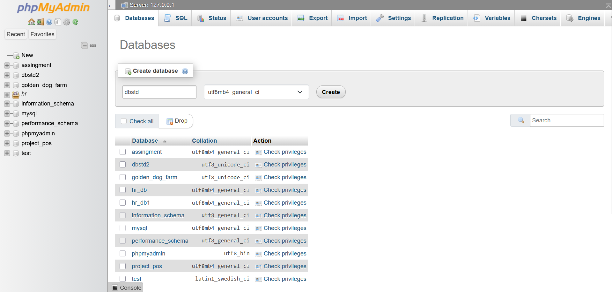
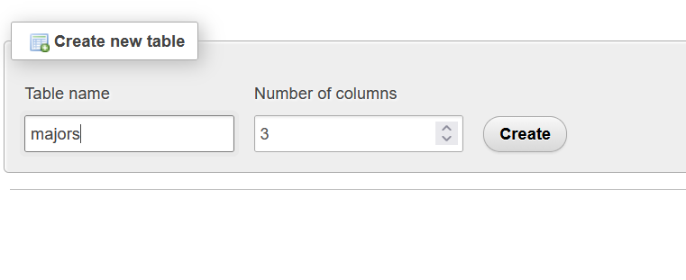
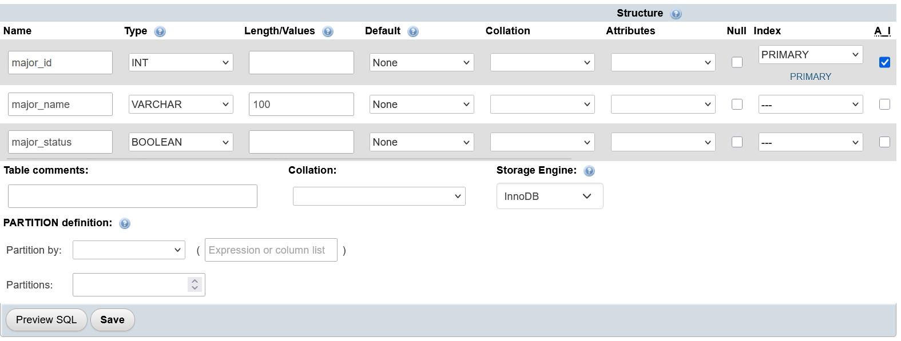
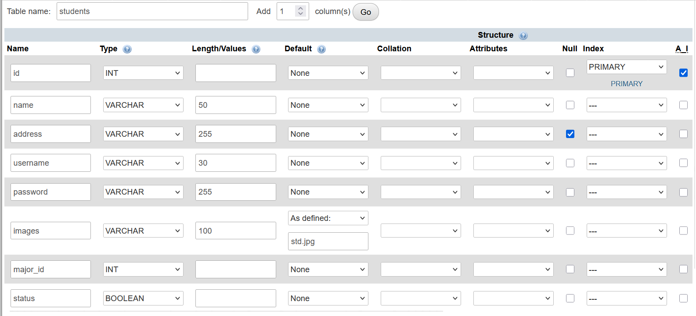
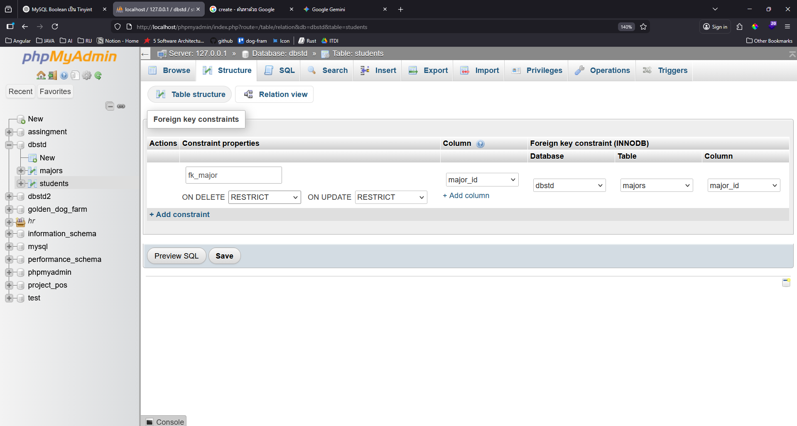

# Lab 07: Create Database in phpmyadmin

## รายวิชา

On-Premise and Off-Premise Relational Database Management

---

## ขั้นตอนที่ 1: สร้าง DATABASE ใหม่

* สร้าง database ชื่อ  `dbstd` 

* สร้าง ตารางชื่อ  `majors` 3 columns

* รายละเอียดในตาราง majors ตามภาพ

| Column      | Type         | Attributes   | Extra       | หมายเหตุ                         |
|------------|-------------|-------------|----------------|----------------------------------|
| major_id   | INT(11)     | PRIMARY KEY | AUTO_INCREMENT | รหัสสาขา           |
| major_name | VARCHAR(100)| NOT NULL    |                | ชื่อสาขาวิชา                     |
| major_status | tinyint(1) 	| NOT NULL    |                | สถานะ                     |

* สร้าง ตารางชื่อ  `students` 8 columns
* รายละเอียดในตาราง students ตามภาพ

| Column    | Type         | Attributes | Extra                       | หมายเหตุ                                      |
|-----------|-------------|------------|-----------------------------|-----------------------------------------------|
| id        | INT(11)     | PRIMARY KEY| AUTO_INCREMENT              |                                               |
| name      | VARCHAR(50) | NOT NULL   |                             | ชื่อ-นามสกุล                                  |
| address   | VARCHAR(255)|    |                             | ที่อยู่                                       |
| username  | VARCHAR(30) | NOT NULL   |                             | ชื่อผู้ใช้                                    |
| password  | VARCHAR(100)| NOT NULL   |                             | รหัสผ่าน                 |
| images    | VARCHAR(100)| DEFAULT 'std.jpg' |                   | ชื่อไฟล์รูปภาพ         |
| major_id  | INT(11)     | INDEX      |                             | Foreign Key อ้างอิงตารางสาขา                 |
| status | tinyint(1) 	| NOT NULL    |                | สถานะ                     |

*ตั้งค่า Foreign Key (FK)
* `ON DELETE` / `ON UPDATE` (RESTRICT): การตั้งเป็น `RESTRICT` ทั้งคู่หมายความว่า:

    - ห้ามลบสาขา: ถ้ายังมีนักศึกษาอยู่ในสาขานั้น ระบบจะไม่ยอมให้ลบชื่อสาขาออกจากตาราง majors (ช่วยป้องกันข้อมูลกำพร้า)

    - ห้ามเปลี่ยนรหัสสาขา: ถ้ามีนักศึกษาใช้งานรหัสสาขานั้นอยู่ จะไม่อนุญาตให้แก้ไขรหัสในตารางแม่

---
# FK แต่ละแบบ
1. CASCADE (ตายตามกัน)

พฤติกรรม: เมื่อข้อมูลในตารางแม่ถูกลบหรือแก้ไข ข้อมูลในตารางลูกที่เชื่อมโยงอยู่จะ "ถูกลบหรือแก้ไขตาม" โดยอัตโนมัติทันที

    ตัวอย่าง: ตารางโพสต์ (แม่) กับ ตารางคอมเมนต์ (ลูก)

    สถานการณ์: ถ้าคุณลบ "โพสต์ Facebook" ทิ้ง "คอมเมนต์" ทั้งหมดที่อยู่ใต้โพสต์นั้นควรจะหายไปด้วย (ไม่งั้นจะกลายเป็นคอมเมนต์ผีที่ไม่มีที่มา)

    เหมาะสำหรับ: ข้อมูลที่เป็นส่วนประกอบของกันและกัน

2. RESTRICT (ห้ามทำ / ขวางไว้)

พฤติกรรม: เป็นค่า Default ของ MySQL ระบบจะ "ไม่อนุญาต" ให้ลบหรือแก้ไขข้อมูลในตารางแม่ ตราบใดที่ยังมีข้อมูลในตารางลูกอ้างอิงถึงมันอยู่

    ตัวอย่าง: ตารางคณะ (แม่) กับ ตารางนักศึกษา (ลูก)

    สถานการณ์: ถ้าคุณพยายามลบ "คณะ IT" ทิ้ง แต่ยังมี "นักศึกษา 500 คน" สังกัดคณะนี้อยู่ ระบบจะฟ้อง Error และไม่ยอมให้ลบ เพื่อป้องกันไม่ให้นักศึกษา 500 คนนั้นกลายเป็นคนไม่มีคณะ

    เหมาะสำหรับ: ข้อมูลสำคัญที่ต้องมีความปลอดภัยสูง เพื่อป้องกันการลบข้อมูลโดยไม่ตั้งใจ

3. SET NULL (กลายเป็นค่าว่าง)

พฤติกรรม: เมื่อข้อมูลในตารางแม่ถูกลบหรือแก้ไข ข้อมูลในตารางลูกจะยังอยู่ แต่คอลัมน์ที่เชื่อมไว้ (FK) จะถูกเปลี่ยนเป็นค่า NULL

    ตัวอย่าง: ตารางพนักงานขาย (แม่) กับ ตารางคำสั่งซื้อ/ออเดอร์ (ลูก)

    สถานการณ์: ถ้า "พนักงานขาย" ลาออก (ลบชื่อออกจากตารางแม่) ออเดอร์ที่เขาเคยขายได้ยังต้องอยู่ในระบบเพื่อสรุปยอดบัญชี แต่เราแค่เปลี่ยนคนดูแลออเดอร์นั้นให้เป็น "ว่าง" (NULL) เพื่อรอคนใหม่มาเสียบแทน

    เหมาะสำหรับ: ข้อมูลที่ลูกยังมีความสำคัญอยู่ แม้แม่จะไม่อยู่แล้วก็ตาม (คอลัมน์นั้นต้องตั้งค่าให้เป็น NULL ได้ด้วยนะครับ)

4. NO ACTION (คล้าย Restrict)

พฤติกรรม: ใน MySQL จะทำงานเหมือนกับ RESTRICT คือจะขวางการลบหรือแก้ไขถ้ายังมีลูกอ้างอิงอยู่ (ความต่างจะเห็นชัดในฐานข้อมูลบางตัวที่จะตรวจเช็คหลังจากจบ Transaction แต่สำหรับมือใหม่ สอนว่าเหมือน RESTRICT ได้เลยครับ)

---

| ตัวเลือก   | ถ้าลบ/แก้ "แม่"        | ผลลัพธ์ที่ "ลูก"                | การใช้งาน                                   |
|------------|------------------------|----------------------------------|----------------------------------------------|
| CASCADE    | ยอมให้ทำ               | ลูกโดนลบ/แก้ตาม                 | ข้อมูลที่ผูกติดกัน                          |
| RESTRICT   | ไม่ยอม (Error)         | ลูกอยู่รอดเหมือนเดิม            | ข้อมูลสำคัญ ป้องกันความผิดพลาด             |
| SET NULL   | ยอมให้ทำ               | ลูกยังอยู่แต่ FK เป็น NULL      | ข้อมูลที่ลบแม่ได้แต่ต้องการเก็บลูกไว้       |
