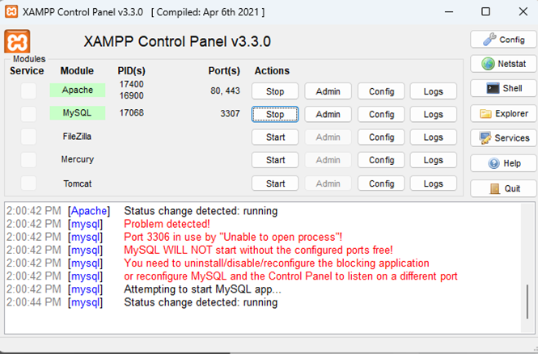
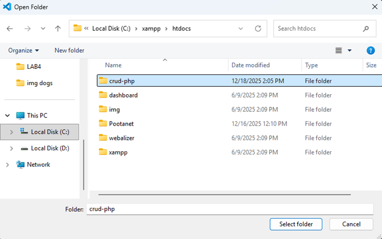

# 01: เริ่มต้นใช้งาน XAMPP และเตรียมโปรเจกต์ PHP

เอกสารนี้ใช้สำหรับเตรียมสภาพแวดล้อมก่อนเริ่มพัฒนาเว็บด้วยภาษา PHP และฐานข้อมูล MySQL

---

## เปิดโปรแกรม XAMPP

1. เปิดโปรแกรม **XAMPP Control Panel**
2. กดปุ่ม **Start** ที่
   - Apache
   - MySQL

---

## สร้างโฟลเดอร์โปรเจกต์

1. เปิด **File Explorer**
2. ไปที่โฟลเดอร์  
    C:\xampp\htdocs

3. สร้างโฟลเดอร์ใหม่ชื่อ crud-php

---

## เปิดโฟลเดอร์ด้วย Visual Studio Code

1. เปิดโปรแกรม **Visual Studio Code**
2. ไปที่เมนู **File → Open Folder**
3. เลือกโฟลเดอร์ C:\xampp\htdocs\crud-php

4. กด **Select Folder**

---

## สร้างfolder imgstd 

1. สร้างfolderใหม่ชื่อ imgstd

2. หารูป .jpg มาใส่ เปลี่ยนชื่อเป็น std.jpg

---

## ตรวจสอบความพร้อม

- Apache และ MySQL ทำงานอยู่
- โฟลเดอร์ `crud-php` เปิดอยู่ใน VS Code
- พร้อมเริ่มเขียน PHP ในขั้นตอนถัดไป