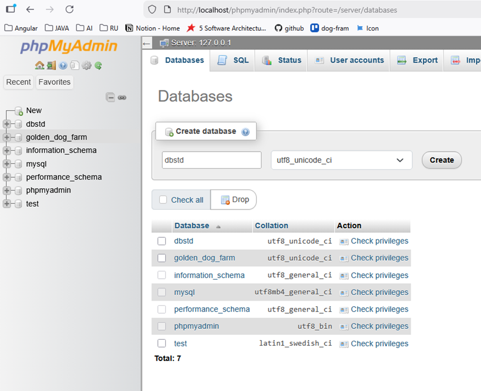
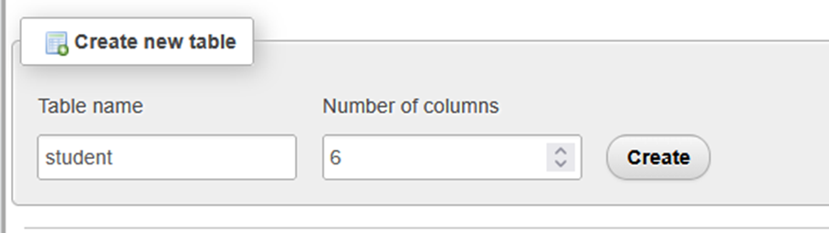
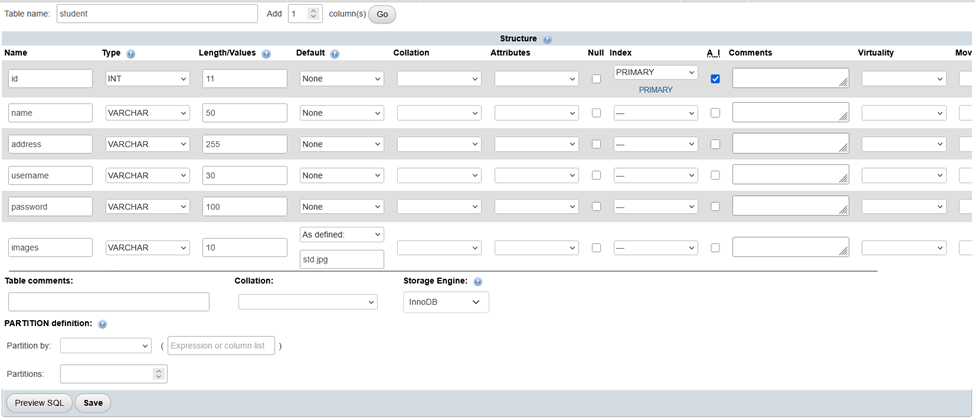
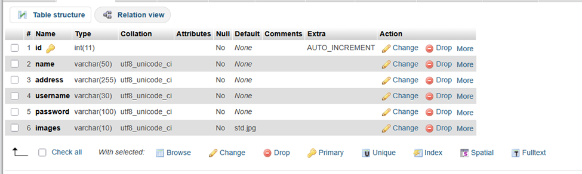

# 02: สร้างฐานข้อมูลและตารางด้วย phpMyAdmin

เอกสารนี้ใช้สำหรับสร้างฐานข้อมูลและตารางสำหรับระบบ CRUD ด้วยภาษา PHP

---

## สร้างฐานข้อมูล (Database)

1. เปิดเว็บเบราว์เซอร์
2. เข้าไปที่  http://localhost/phpmyadmin

3. ที่เมนูด้านซ้าย คลิก **New**
4. ตั้งชื่อฐานข้อมูลเป็น  dbstd

5. กดปุ่ม **Create**



---

## สร้างตาราง student

1. คลิกเลือกฐานข้อมูล **dbstd**
2. ในช่องสร้างตาราง
- ชื่อตาราง:  
  ```
  student
  ```
- จำนวนคอลัมน์ (Number of columns):  
  ```
  6
  ```
3. กดปุ่ม **Create**



---

## กำหนดโครงสร้างตาราง

กำหนดคอลัมน์ของตาราง `student` ตามตัวอย่างที่อาจารย์ให้ 

1. ตรวจสอบชื่อคอลัมน์ ชนิดข้อมูล และความยาวให้ถูกต้อง
2. ตั้งค่า `id` เป็น **Primary Key** และ **Auto Increment**
3. เมื่อกำหนดครบแล้ว กดปุ่ม **Save**



---

## ตรวจสอบผลลัพธ์


1. ตรวจสอบว่า
- ชื่อตารางถูกต้อง
- มีทั้งหมด 6 คอลัมน์
- โครงสร้างตรงตามตัวอย่าง



---

## สรุป

- สร้างฐานข้อมูลชื่อ `dbstd` สำเร็จ
- สร้างตาราง `student` จำนวน 6 คอลัมน์เรียบร้อย
- พร้อมนำไปใช้งานในขั้นตอนการเขียน PHP CRUD ต่อไป